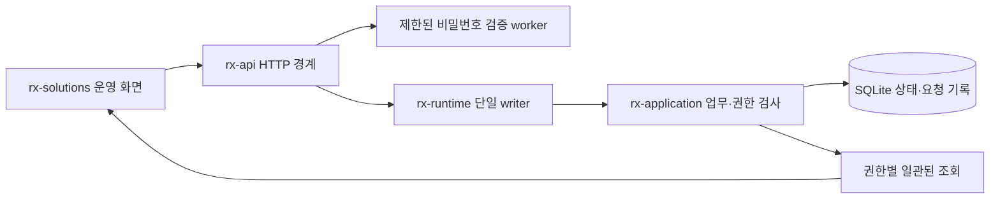

# 로컬 사용자 API와 서비스 초안

`rx-api`는 브라우저 요청을 `rx-runtime::application::Handle`로 넘긴다. 전용 writer가 실제 `rx-application::Engine`와 SQLite를 소유한다. HTTP handler에 별도 업무 상태기계나 SQL 연결을 두지 않는다.

현재 실행 파일 `rx-platform-local`은 **DEVELOPMENT_LOOPBACK 전용**이다. Host 연결·운전 자격 발급·장비 launcher가 없고, 브라우저에 등록 단말 신원을 부여하지 않는다. 제품용 LAN/TLS ingress와 프로세스 관리자의 대체물이 아니다. 첫 현장의 운전 자격은 미확정 상태로 유지한다.

## 구조

- `auth.rs`: 고정 Argon2id profile, 검증 작업 제한, opaque cookie 연결. 비밀번호 검증이 writer를 점유하지 않는다.
- `routes.rs`: 실제 접속 주소·Host/Origin/CSRF 검사, 엄격한 JSON decode, application 호출, 캐시 금지 응답.
- `error.rs`: 도메인 거부를 HTTP 오류로 변환. SQL·파일 경로를 응답에 노출하지 않고, commit 결과가 미확정이면 `outcome_unknown=true`를 보존한다.
- `bin/local.rs`: 명시적 새 설치 생성, private 설정 파일, 로컬 listener, 종료 신호와 writer drain.

Axum 0.8.9와 RustCrypto Argon2 0.5.3을 lock했다. 프레임워크 사용법은 [Axum server](https://docs.rs/axum/0.8.9/axum/fn.serve.html), [RustCrypto Argon2](https://docs.rs/argon2/0.5.3/argon2/)를 기준으로 확인했다. 라이브러리 채택은 제품 보안 검증 완료를 의미하지 않는다.

## 접근 경계

1. 실제 socket peer가 loopback이어야 한다. 임의 `X-Forwarded-*`나 단말·역할 헤더를 신원으로 읽지 않는다.
2. Host는 설정된 public origin의 authority와 정확히 같아야 한다. 변경 요청은 같은 Origin, `X-RX-Client: browser-v1`, JSON Content-Type을 요구한다. CORS 허용 우회는 없다.
3. 요청 body에서 principal/role/session/terminal을 받아 업무 Identity를 만들지 않는다. 로그인만 principal/password를 받는다.
4. 계정 역할과 셀 범위는 DB에서 매 요청마다 다시 확인한다. 역할 회수 이후에는 idempotency cache로 성공을 회수할 수 없다.
5. 브라우저 로그인으로 Host/Executor 계정을 발급하지 않는다. service identity lifecycle은 별도 계약 경계다.
6. cookie는 난수 256bit, API 메모리에는 SHA-256 식별만 보관한다. `HttpOnly; SameSite=Strict; Path=/api`, 1시간 절대 만료, 최대 1,024개다. DB의 session은 runtime boot와 시계·만료를 대조한다. API/runtime 재시작 후 이전 cookie는 재사용할 수 없다.
7. HTTP loopback 개발용 cookie에 Secure를 붙이지 않는다. 실제 LAN 서비스는 TLS·Secure cookie·검증된 단말 인증과 별도 검증이 필요하다. 이 listener를 `0.0.0.0`에 여는 선택지는 거부한다.
8. 비밀번호 hash는 Argon2id v19, m=19,456 KiB/t=2/p=1, 32byte 출력이다. catalog가 다른 파라미터를 요구하면 기동 시 거부한다. 동시에 2개 hashing 작업, 설치 전체 분당 30회 시도 제한. 알 수 없는 계정에도 같은 profile의 dummy 검증을 수행한다.

현재 account credential catalog는 기동 시 읽는 private file이다. 계정 추가/비밀번호 변경/감사 정책·credential migration·배포용 secret provisioning은 후속 범위다. DB principal 편집과 credential 변경을 한 제품 사용자 흐름으로 완성한 상태가 아니다.

## HTTP 표면

아래는 브라우저용 **초기 BFF binding**이다. frozen base/cell gRPC의 전체 구현 또는 새 normative manifest로 취급하지 않는다. Counter/Id/Digest 및 업무 입력은 기존 도메인 형식을 따른다.

| Method/path | 입력 | 처리 |
|---|---|---|
| GET `/api/v1/health` | 없음 | writer 가용성과 개발 모드. 장비 운전 가능을 의미하지 않음 |
| POST `/api/v1/session` | principal, password | credential worker → writer session 발급. cookie와 사용자 profile |
| GET `/api/v1/session` | cookie | 현재 principal/역할/셀 범위/만료 |
| POST `/api/v1/session/end` | `{}` | user session 비활성화와 cookie 제거. 생산 보류 요청과 다름 |
| GET `/api/v1/overview` | cookie | 허용된 셀·실행·작업의 일관된 snapshot |
| GET `/api/v1/cell?id=...` | URL-encoded Name | 해당 셀의 현재 구성/revision |
| POST `/api/v1/cells` | request_key, command: CellConfiguration | Engineer + 셀 범위. immutable 최초 등록, key와 같은 transaction에 저장 |
| GET `/api/v1/run/checkpoint?id=...` | run UUID, cookie | 현재 접근권을 확인한 frozen RunView/Checkpoint와 immutable artifact 참조 |
| GET `/api/v1/run/checkpoint/artifact` | run, sha256, schema_id, size_bytes, cookie | 해당 run 소유 참조의 정확한 canonical bytes. 현재 셀 접근권/해시/크기 재검사 |
| POST `/api/v1/runs` | request_key, command: CreateRun | Operator + 셀 범위. 실행 준비 기록과 요청 결과 저장 |
| POST `/api/v1/runs/start` | request_key, command: StartRun | 기존 application의 전체 시작 검사. 이 listener는 terminal=None이므로 시작 권한을 통과하지 못함 |
| POST `/api/v1/cells/hold` | request_key, command: `{cell}` | Operator. 관련 권한 철회·차단/outbox 기록, 물리 정지 확인과 별개 |

mutation key는 canonical UUID다. 로그인 body 최대 4 KiB, 일반 요청 최대 1 MiB. JSON 중복/unknown field는 typed decode 전에/중에 거부한다. 같은 key의 바뀐 내용은 `KEY_CONFLICT`다. 알려진 거부와 응답 유실을 UI에서 구별한다.

## 조회의 의미와 한계

- 권한 확인과 셀/run/work 읽기는 같은 transaction에서 한다. 다른 셀, 계정 session, credential은 projection에 포함하지 않는다.
- `snapshot_id`는 해당 조회의 opaque ID다. 전역 control journal seq 또는 재개 가능한 SSE cursor가 아니다. 권한으로 걸러진 목록을 전역 연속 stream처럼 보이게 하지 않는다.
- 셀별 run 50개, work 100개까지 표시하며 `*_truncated`를 명시한다. UUID 기준 내림차순은 표시 순서이며 물리 시간 순서를 증명하지 않는다.
- 현재는 내부 scan 후 response를 제한한다. 대규모 journal의 bounded indexed read, paged snapshot lease, 권한별 UI projection cursor/SSE·느린 소비자 처리는 후속 구현이다. 현재 조회 비용을 제품 규모에서 검증하지 않았다.
- qualification 기록 유무는 실시간 운전 가능 상태가 아니다. UI도 이를 `운전 자격 미등록/기록 있음`으로 표시한다.

Checkpoint 읽기의 저장/복원 경계는 [내용 주소 artifact](../rx-application/CHECKPOINT_ARTIFACT.md)에 정리했다. 과거 EXECUTING 상태를 조회해도 현재 실행 권한은 부여되지 않는다. 이 BFF는 executor mTLS/Workflow API를 대신하지 않는다.

## 실행

platform 레포에서 `./tools/cargo build -p rx-api --bin rx-platform-local --locked`로 빌드한다.

1. `target/debug/rx-platform-local init NEW_DIRECTORY [CELL_ID ...]`의 stdin으로 사용할 비밀번호를 전달한다. 명령줄 인수에 비밀번호를 넣지 않는다. 초기 계정은 admin이며 기본 셀 범위는 `cell/demo`다. 기본 비밀번호는 없다.
2. `target/debug/rx-platform-local serve DIRECTORY 127.0.0.1:8080 http://127.0.0.1:5173`로 실행한다. public origin은 solutions UI 개발 서버의 정확한 origin이다.
3. solutions의 `apps/operator`에서 UI를 실행한다. Vite가 같은 Host/Origin을 보존하여 `/api`를 platform에 전달한다.

init은 기존 디렉토리/설정을 덮어쓰지 않는다. 설정 두 파일은 Unix 0600, 새 디렉토리는 0700으로 생성한다. DB는 지정된 개발 설치 디렉토리에만 만들어진다. 중간 초기화 실패의 제품용 복구 UX와 host 설치 도구는 아직 후속 범위다.

개발 clock은 프로세스 내 `Instant`와 새 clock ID를 사용한다. 실제 납품의 공유 CLOCK_BOOTTIME/호스트 boot 신원/획득 오차 검증을 대신하지 않으며, 이 clock으로 물리 Host 연결을 허용하지 않는다.

`cargo test -p rx-api --test http`는 mock Engine 없이 실제 writer/SQLite를 사용하며 별도 TCP listener도 검증한다. 이것은 물리 장비 검증이나 배포용 보안 인수 시험이 아니다.

별도의 [Host 증거 gRPC 수신 경계](src/grpc/README.md)도 같은 writer에 연결했다. 로컬 HTTP binary에 자동 기동하지 않으며, producer 순서·원본·수신 확인과 공개 원장 cursor의 미완료 경계를 구별한다.

비운전 사건 종료의 개발 POST 경로는 `/api/v1/cases/close-preparations`와 `/api/v1/cases/close-without-restart`다. 현재 RecoveryLead, 셀·사건 CAS와 검증된 절차/인원/관측 근거를 요구한다. 종료 후에도 운전 제외 차단을 유지한다. [범위와 미구현 경계](../rx-application/NON_OPERATING_CLOSURE.md)를 따른다.

`GET /api/cell/v1/cells/{cell_id}/inspect`는 현재 HTTP 사용자 범위로 조회한 셀을 frozen RX JSON으로 반환한다. ID는 하나의 path segment로 encoding한다. 저장 metadata가 없는 이전 기록은 UPGRADE_REQUIRED다. [조회·서비스 세션·저장 버전 경계](../rx-application/CELL_CONTEXT_AND_OPERATOR_PEER.md).

등록 단말용 API ingress는 `terminal_https::TerminalHttps`다. 실제 TLS client certificate와 계정 자격으로 Session의 terminal binding을 만들고 현재 등록/셀 범위를 다시 검사한다. 개발 CLI의 loopback 정책과 별도이며 제품 supervisor/배포 연결은 후속이다. [구성·검증·한계](../rx-application/TERMINAL_IDENTITY.md)를 따른다.

## 패키지 반입

`package-intake-context`, `package-intakes` GET/POST, `package-intake` GET을 [반입 계약](../rx-application/PACKAGE_INTAKE.md)에 연결했다. 현재 사용자/단말의 셀 범위를 적용하며 worker 결과를 writer가 다시 검사한다. 온라인 worker 미구성 시 신규 반입은 불가하고 이력 조회는 가능하다. 공정 패키지의 소프트웨어 검토 승인 API는 아래 검토 계약에 연결했고, 활성화 API는 후속이다.

공정 패키지의 `process-reviews`, `process-review`, `process-review/reports`, `process-review/decisions` API와 역할/버전/CAS 규칙은 [검토 계약](../rx-application/PROCESS_REVIEW.md)에 둔다.

검토 목록은 GET `/api/v1/process-reviews`의 cell/intake/after, 과거 검토는 GET `/api/v1/process-review`의 선택 revision으로 조회한다. 역사 조회는 승인 대상의 최신성 검사를 변경하지 않는다. 로컬 개발 서비스의 private `package-service.json`은 테스트용 반입/검토 worker를 명시적으로 구성할 때만 사용한다.

변경 제안·영향 검토·staging·적용 준비 API는 [PROCESS_CHANGE.md](../rx-application/PROCESS_CHANGE.md)에 둔다. 준비는 현재 단말의 ReleaseManager만 가능하며 실제 적용/활성화 완료로 응답하지 않는다.
