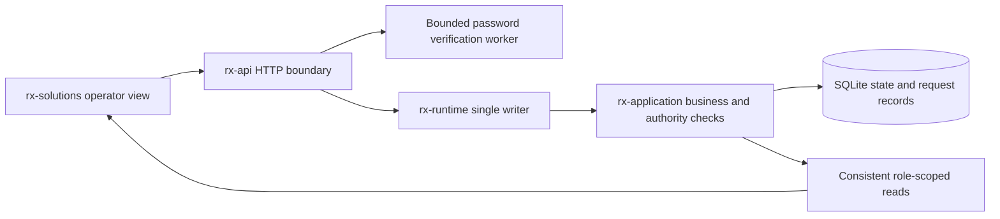

# Local user API and service draft

`rx-api` forwards browser requests to `rx-runtime::application::Handle`. The dedicated writer owns the actual `rx-application::Engine` and SQLite. HTTP handlers contain neither a separate business state machine nor SQL connections.

The current executable, `rx-platform-local`, is **DEVELOPMENT_LOOPBACK only**. It has no Host connection, operating-qualification issuance, or device launcher and does not grant registered-terminal identity to the browser. It does not replace product LAN/TLS ingress or a process manager. Operating qualification for the first site remains undetermined.

## Structure

- `auth.rs`: fixed Argon2id profile, bounded verification work, opaque cookie binding. Password verification does not occupy the writer.
- `routes.rs`: actual peer address, Host/Origin/CSRF checks, strict JSON decoding, application calls, no-cache responses.
- `error.rs`: convert domain rejections into HTTP errors. Do not expose SQL/file paths in responses; preserve `outcome_unknown=true` when commit outcome is uncertain.
- `bin/local.rs`: explicit new-installation creation, private configuration files, local listener, shutdown signals, and writer drain.

Axum 0.8.9 and RustCrypto Argon2 0.5.3 are locked. Framework usage was checked against [Axum server](https://docs.rs/axum/0.8.9/axum/fn.serve.html) and [RustCrypto Argon2](https://docs.rs/argon2/0.5.3/argon2/). Adopting these libraries does not mean product security validation is complete.

## Access boundary

1. The actual socket peer must be loopback. Arbitrary `X-Forwarded-*`, terminal, or role headers are not used as identity.
2. Host must exactly match the authority of the configured public origin. Mutations require the same Origin, `X-RX-Client: browser-v1`, and JSON Content-Type. There is no CORS allowlist bypass.
3. Business Identity is not constructed from principal/role/session/terminal in request bodies. Only login accepts principal/password.
4. Account roles and cell scope are rechecked in the DB on every request. After role revocation, the idempotency cache cannot retrieve a successful result.
5. Browser login does not issue Host/Executor accounts. Service identity lifecycle is a separate contract boundary.
6. Cookies contain 256 random bits; API memory stores only their SHA-256 identifiers. They use `HttpOnly; SameSite=Strict; Path=/api`, absolute expiry of 1 hour, and a maximum of 1,024 entries. DB sessions are checked against runtime boot, clock, and expiry. Old cookies cannot be reused after API/runtime restart.
7. HTTP loopback development cookies do not use Secure. An actual LAN service needs TLS, Secure cookies, validated terminal authentication, and separate validation. Opening this listener on `0.0.0.0` is rejected.
8. Password hashes use Argon2id v19, m=19,456 KiB/t=2/p=1, with 32byte output. Catalogs requesting other parameters are rejected at startup. At most 2 hashing jobs run concurrently, with an installation-wide limit of 30 attempts per minute. Unknown accounts receive dummy verification under the same profile.

The current account credential catalog is a private file read at startup. Account creation, password changes, audit policy, credential migration, and deployment secret provisioning remain future scope. DB principal editing and credential changes are not yet a complete product user flow.

## HTTP surface

The following is an **initial browser BFF binding**. Do not treat it as the complete frozen base/cell gRPC implementation or a new normative manifest. Counter/Id/Digest and business inputs follow existing domain formats.

| Method/path | Input | Handling |
|---|---|---|
| GET `/api/v1/health` | None | Writer availability and development mode; does not establish device operating readiness |
| POST `/api/v1/session` | principal, password | Credential worker → writer session issuance; cookie and user profile |
| GET `/api/v1/session` | cookie | Current principal/roles/cell scope/expiry |
| POST `/api/v1/session/end` | `{}` | Deactivate user session and remove cookie; distinct from requesting production hold |
| GET `/api/v1/overview` | cookie | Consistent snapshot of permitted cells/runs/operations |
| GET `/api/v1/cell?id=...` | URL-encoded Name | Current configuration/revision of that cell |
| POST `/api/v1/cells` | request_key, command: CellConfiguration | Engineer + cell scope; immutable initial registration stored in the same transaction as the key |
| GET `/api/v1/run/checkpoint?id=...` | run UUID, cookie | Frozen RunView/Checkpoint and immutable artifact references after checking current access |
| GET `/api/v1/run/checkpoint/artifact` | run, sha256, schema_id, size_bytes, cookie | Exact canonical bytes of a run-owned reference; recheck current cell access/hash/size |
| POST `/api/v1/runs` | request_key, command: CreateRun | Operator + cell scope; persist run preparation and request result |
| POST `/api/v1/runs/start` | request_key, command: StartRun | All existing application start checks; this listener has terminal=None and cannot pass start authorization |
| POST `/api/v1/cells/hold` | request_key, command: `{cell}` | Operator; revoke related authority and record blocks/outbox, separately from physical-stop confirmation |

Mutation keys are canonical UUIDs. Login bodies are limited to 4 KiB; ordinary requests to 1 MiB. Duplicate/unknown JSON fields are rejected before/during typed decoding. Changed content under the same key produces `KEY_CONFLICT`. The UI distinguishes known rejection from response loss.

## Read semantics and limitations

- Authority checks and cell/run/work reads occur in the same transaction. Projections omit other cells, account sessions, and credentials.
- `snapshot_id` is an opaque ID for that read, not a global control-journal sequence or resumable SSE cursor. Permission-filtered lists must not appear to be a globally continuous stream.
- At most 50 runs and 100 work entries per cell are displayed, with explicit `*_truncated`. Descending UUID order is a display order, not proof of physical chronology.
- Currently the response is bounded after an internal scan. Bounded indexed reads of large journals, paged snapshot leases, permission-scoped UI projection cursors/SSE, and slow-consumer handling remain future implementation. Current read costs have not been validated at product scale.
- The presence of qualification records is not real-time operating readiness. The UI likewise labels this as `Operating qualification unregistered/record present`.

Checkpoint storage/restoration boundaries are documented in [content-addressed artifacts](../rx-application/CHECKPOINT_ARTIFACT.md). Reading historical EXECUTING state grants no current execution authority. This BFF does not replace executor mTLS/Workflow APIs.

## Execution

Build from the platform repository with `./tools/cargo build -p rx-api --bin rx-platform-local --locked`.

1. Pass the intended password through stdin to `target/debug/rx-platform-local init NEW_DIRECTORY [CELL_ID ...]`. Do not put passwords in command-line arguments. The initial account is admin, and default cell scope is `cell/demo`. There is no default password.
2. Run `target/debug/rx-platform-local serve DIRECTORY 127.0.0.1:8080 http://127.0.0.1:5173`. The public origin is the exact origin of the solutions UI development server.
3. Start the UI from solutions `apps/operator`. Vite forwards `/api` to platform while preserving the same Host/Origin.

Init does not overwrite existing directories/configuration. Its two configuration files use Unix 0600; the new directory uses 0700. The DB is created only in the designated development installation directory. Product recovery UX for interrupted initialization and Host installation tools remain future scope.

The development clock uses process-local `Instant` and a new clock ID. It does not replace validation of a shared CLOCK_BOOTTIME, host boot identity, or acquisition error for actual delivery; physical Host connections are not permitted under this clock.

`cargo test -p rx-api --test http` uses an actual writer/SQLite without a mock Engine and also checks a separate TCP listener. It is not physical-device validation or deployment security acceptance.

A separate [Host evidence gRPC ingress boundary](src/grpc/README.md) is also connected to the same writer. It is not automatically started in the local HTTP binary. Distinguish producer ordering, originals, and acknowledgment from the incomplete public-ledger cursor boundary.

Development POST routes for non-operating case closure are `/api/v1/cases/close-preparations` and `/api/v1/cases/close-without-restart`. They require the current RecoveryLead, cell/case CAS, and verified procedure/personnel/observation evidence. Operating-exclusion blocks remain after closure. Follow the [scope and unimplemented boundaries](../rx-application/NON_OPERATING_CLOSURE.md).

`GET /api/cell/v1/cells/{cell_id}/inspect` returns a cell queried under current HTTP user scope as frozen RX JSON. Encode the ID as one path segment. Older records without storage metadata return UPGRADE_REQUIRED. [Read, service-session, and storage-version boundaries](../rx-application/CELL_CONTEXT_AND_OPERATOR_PEER.md).

API ingress for registered terminals is `terminal_https::TerminalHttps`. It creates a Session terminal binding from the actual TLS client certificate and account credentials, then rechecks current registration/cell scope. It is separate from the development CLI's loopback policy; product supervisor/deployment integration remains future work. Follow the [configuration, validation, and limitations](../rx-application/TERMINAL_IDENTITY.md).

## Package intake

Connected `package-intake-context`, `package-intakes` GET/POST, and `package-intake` GET to the [intake contract](../rx-application/PACKAGE_INTAKE.md). Current user/terminal cell scope applies, and the writer rechecks worker results. Without a configured online worker, new intake is unavailable but history reads remain available. Software review-approval APIs for process packages connect to the review contract below; activation APIs remain future work.

The process-package `process-reviews`, `process-review`, `process-review/reports`, and `process-review/decisions` APIs and role/version/CAS rules are documented in the [review contract](../rx-application/PROCESS_REVIEW.md).

Read review lists using cell/intake/after on GET `/api/v1/process-reviews`; read historical reviews using optional revision on GET `/api/v1/process-review`. Historical reads do not change freshness checks for approval targets. The local development service's private `package-service.json` is used only when explicitly configuring test intake/review workers.

Change proposal, impact review, staging, and application-preparation APIs are documented in [PROCESS_CHANGE.md](../rx-application/PROCESS_CHANGE.md). Only the current terminal's ReleaseManager may prepare; the response does not claim completed application/activation.
