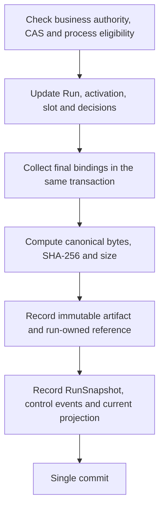

# Execution recovery state and content-addressed artifacts

Status: implementation draft. Connected to P's actual storage transaction and local reads. Executor remote recovery and [external Workflow.CommitCheckpoint](CHECKPOINT_COMMIT.md) are connected. Providing the complete public journal and delivery acceptance remain separate completion criteria.

## Responsibilities

After a restart, the executor must recover the run/activation/slot bindings and process decisions that P has already created before creating a new operation. It cannot reassign an operation based only on its local BT tick position or last response.

P creates recovery state in the transaction that changes the run revision. A separate asynchronous task does not read later DB state and store it as a checkpoint for a historical revision. Permission to read an artifact is distinct from permission to continue work. An EXECUTING value inside a historical artifact is not current operating permission.

## Storage structure

| Record | Stored content | Mutation rule |
|---|---|---|
| `run/<key>` | Business Run and repository revision | Preserve existing business CAS |
| `artifact/<digest key>` | `rx.executor-state.v1` payload | Only identical content is permitted; existing bytes cannot be replaced |
| `checkpointartifact/<run,digest key>` | Exact ArtifactRef owned by the run | Another run's artifact cannot be read by hash alone |
| `runcheckpoint/<run key>` | `rx.control.run-snapshot.v1` RunSnapshot | Replace the current Run and checkpoint in the same commit |
| Run in `control_events/control_entities` | RunSnapshot from that commit | Historical cut that does not join the current DB later |

Keys in the table are logical notation. Actual keys follow the domain-hash rules of the existing `persistence::key`. Arbitrary file paths or external URLs are neither stored nor read.

`ExecutorState` contains:

- `schema=rx.executor-state.v1`, to be pinned in the release.
- The Run and run revision at that point.
- Activation ID, node ID, visit, and each slot's operation ID and intent digest.
- Per-visit ProcessCheckpoint: committed branch, wait window/result, decision time and evidence links.

It is not a complete copy of Operation results, current resource handover or the current cell epoch. This information must be reconciled with current P state before execution continues. Results or support release are not inferred from the existence of a checkpoint.

The artifact payload is JSON for that schema. Nullable values in the business model also belong to this schema. It is separate from the RX JSON projection of public `RunView/Checkpoint`; the `rx-protocol` codec applies public-wire rules for omitting optionals, uint64 strings and Digest hex.

## Creation order within one transaction

1. `Journaled` captures actual Run changes. Even if there are multiple changes in one transaction, it uses the final state.
2. Read run-owned records under `activation/`. Do not include duplicate records used for ID lookup again. Read each slot's Work and check the run/activation/slot/part/cell/operation bindings.
3. Canonicalize activations by `(node, visit)`, slots by name, and ProcessCheckpoints by visit order.
4. Apply SHA-256 to the **actual payload bytes** produced by `canonical::bytes`. Do not substitute a semantic fingerprint or arbitrary placeholder digest. `size_bytes` is the length of these bytes as well.
5. Write the artifact, ownership reference, current RunSnapshot and control records in the same repository transaction. Creation/write failure rolls back together with business changes, request results and outbox.
6. Artifact creation does not additionally increment the Run's business revision. The public Checkpoint revision is that Run revision.

An existing store receives a one-time checkpoint seed. Earlier control journals are not regenerated, and historical artifacts are not fabricated. Existing runs' current states become initial artifacts, with a marker recorded in the same transaction. Historical events subsequently retain the schema used at the time; complete public-journal migration is not yet finished.

## Reads and integrity

`Engine::run_checkpoint` checks the current session, account and cell access before comparing the content/revision of the current Run and RunSnapshot. It also validates the checkpoint's run/revision/schema, the content of the actual owned artifact and its activation bindings.

`Engine::checkpoint_artifact` checks current run access and the per-run ownership reference, then compares schema/digest/size. Before returning, it canonicalizes again and checks hash/size. An incorrect schema/size is not allowed even with the same hash. Reads are denied even if a user whose access was revoked retains an old reference.

Older artifacts remain readable unchanged after a new revision is created. The current snapshot after a P restart reflects authority revocation, while older snapshots are preserved as historical facts. Recovery reads do not revive an existing mandate or session.

## External connections

- `RunCheckpoint` and `CheckpointArtifact` typed commands are connected to Runtime.
- `rx-protocol-adapter::workflow` converts to frozen `RunView/Checkpoint/ActivationView/SlotBinding`. It does not perform imprecise numeric conversions of UINT64.
- The local BFF's `GET /api/v1/run/checkpoint?id=...` returns the public RunView form.
- `GET /api/v1/run/checkpoint/artifact?run=...&sha256=...&schema_id=...&size_bytes=...` returns the exact canonical payload bytes. It checks the current browser cookie/cell access every time and prohibits caching.

These two routes are DEVELOPMENT_LOOPBACK read features. They do not create service-peer sessions from browser cookies. Actual executor mTLS `Workflow.GetRun` is connected to [registration/cell negotiation/current authority checks](EXECUTOR_PEER.md). Run-owned artifact reads and actual C++ Frame inputs are connected to [current execution-state reads](EXECUTION_READ.md). Finite-operation/Pause/handover Frames/request workers and CAS input validation for `CommitCheckpoint` are connected. Branch/wait workers are connected; the complete resident loop is follow-up work. This feature is not described as an activated executor recovery procedure.

## Capacity and follow-up conditions

Currently, each run's history is placed in one artifact and activation list, and target collection uses an entity scan. The general document/HTTP/wire limit of 1 MiB is retained. The size limit is not relaxed to hide the problem, and a write failure does not return a partial checkpoint as a success.

Admission budgets/capacity reservations for long production runs, indexed lookup, artifact paging/retention and export/backup/restore policies are not yet implemented. The storage model needs further separation so that subsequent evidence and authority revocation can still be accepted when the limit is reached. This limitation remains an incomplete item for product long-duration operation validation. Deletion/GC is not provided.

## Tests

- Failure immediately before T1: Run/slot/artifact/current projection remain together in their previous state.
- Lost response after T1 commit: recovery with the same key returns the one existing operation and preserves only one artifact for the same revision.
- Exact hash/size/schema and actual operation/intent bindings; immutability of older artifacts.
- P restart: preservation of branch decisions/evidence times, current authority revocation and new snapshot, and older snapshot reads.
- Rejection of another run's ownership reference, incorrect size and revoked current cell access.
- Recovery of frozen RunView and payload bytes through the actual HTTP writer/SQLite path; rejection of unauthenticated and duplicate/unknown queries.
- Strict RX JSON round trips for all six RunStates and Counters greater than 2^53.

All device inputs are simulation fixtures. These tests do not establish actual robot completion, process quality, field recovery or qualification.
