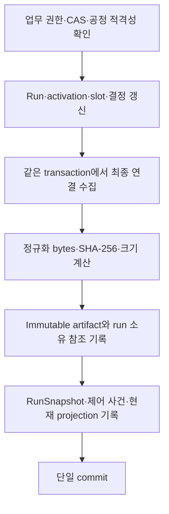

# 실행 복원 상태와 내용 주소 artifact

상태: 구현 초안. P의 실제 저장 transaction·로컬 조회에 연결했다. 실행기의 원격 복원과 [외부 Workflow.CommitCheckpoint](CHECKPOINT_COMMIT.md)를 연결했다. 전체 공개 원장 제공과 납품 검증은 별도 완료 조건이다.

## 책임

실행기는 재시작 후 새 작업을 만들기 전에 P가 이미 만든 run/activation/slot 연결과 공정 결정을 회수해야 한다. 로컬 BT의 tick 위치나 마지막 응답만으로 작업을 다시 할당할 수 없다.

P가 run revision을 변경하는 transaction에서 복원 상태를 생성한다. 별도 비동기 작업이 나중의 DB 상태를 읽어 과거 revision의 checkpoint로 저장하지 않는다. Artifact를 읽는 권한과 작업을 계속하는 권한도 구별한다. 과거 artifact 안의 EXECUTING 표시는 현재 운전 허가가 아니다.

## 저장 구조

| 레코드 | 저장 내용 | 변경 규칙 |
|---|---|---|
| `run/<key>` | 업무 Run과 repository revision | 기존 업무 CAS 유지 |
| `artifact/<digest key>` | `rx.executor-state.v1` payload | 동일 내용만 허용, 기존 bytes 교체 금지 |
| `checkpointartifact/<run,digest key>` | 해당 run이 소유한 정확한 ArtifactRef | 다른 run의 artifact를 hash만으로 읽지 못함 |
| `runcheckpoint/<run key>` | `rx.control.run-snapshot.v1` RunSnapshot | 현재 Run과 checkpoint를 같은 commit에서 교체 |
| `control_events/control_entities`의 Run | 그 commit의 RunSnapshot | 현재 DB를 나중에 조인하지 않는 과거 cut |

표의 key는 논리 표기다. 실제 key는 기존 `persistence::key`의 domain hash 규칙을 사용한다. 임의 파일 경로나 외부 URL을 저장하거나 읽지 않는다.

`ExecutorState`는 다음을 포함한다.

- release에 고정할 `schema=rx.executor-state.v1`.
- 해당 시점의 Run과 run revision.
- activation ID, node ID, visit, 각 slot의 operation ID와 intent digest.
- visit별 ProcessCheckpoint: 확정 분기, wait window/result, 판단 시각과 근거 연결.

Operation 결과·현재 자원 인계·현재 cell epoch의 전체 복사본은 아니다. 계속 실행하기 전에 이 정보와 현재 P 상태를 함께 조정해야 한다. 결과나 지지 해제를 checkpoint의 존재로 추론하지 않는다.

Artifact payload는 해당 schema의 JSON이다. 업무 model의 nullable 값도 이 schema에 속한다. 공개 `RunView/Checkpoint`의 RX JSON 투영과 별개이며, 공개 wire의 optional 생략·uint64 문자열·Digest hex 규칙은 `rx-protocol` codec으로 적용한다.

## 한 transaction 안의 생성 순서

1. `Journaled`가 실제 Run 변경을 포착한다. 같은 transaction에서 여러 차례 바뀌어도 최종 상태를 사용한다.
2. `activation/`의 run 소유 레코드를 읽는다. ID 조회용 중복 레코드를 다시 포함하지 않는다. 각 slot의 Work를 읽어 run/activation/slot/part/cell/operation 연결을 대조한다.
3. activation은 `(node, visit)`, slot은 이름, ProcessCheckpoint는 visit 순으로 정규화한다.
4. `canonical::bytes`로 생성한 **실제 payload bytes**에 SHA-256을 적용한다. 의미 fingerprint나 임의 placeholder digest로 대체하지 않는다. `size_bytes`도 이 bytes의 길이다.
5. artifact, 소유 참조, 현재 RunSnapshot과 제어 기록을 repository의 동일 transaction에 기록한다. 생성/기록 실패는 업무 변경·요청 결과·outbox와 함께 rollback된다.
6. Run의 업무 revision을 artifact 생성 때문에 추가 증가시키지 않는다. 공개 Checkpoint revision은 해당 Run revision이다.

기존 저장소에는 한 번의 checkpoint seed를 적용한다. 이전 control journal을 다시 생성하거나 과거 artifact가 있었다고 꾸미지 않는다. 기존 run들의 현재 상태를 초기 artifact로 잡고 marker를 같은 transaction에 남긴다. 이후 과거 사건은 당시의 기존 schema로 유지되며, 전체 공개 원장 migration은 아직 완료하지 않았다.

## 읽기와 무결성

`Engine::run_checkpoint`는 현재 세션·계정·셀 접근권을 확인한 뒤 현재 Run과 RunSnapshot의 내용/revision을 비교한다. checkpoint의 run/revision/schema와 실제 소유 artifact의 내용·activation 연결도 검증한다.

`Engine::checkpoint_artifact`는 현재 run 접근권과 run별 소유 참조를 확인하고 schema/digest/size를 모두 대조한다. 반환 전 다시 정규화하여 hash·size를 확인한다. 같은 hash라도 잘못된 schema/size를 허용하지 않는다. 권한이 회수된 사용자가 과거 참조를 보관하고 있어도 읽기는 거부된다.

이전 artifact는 새 revision 생성 후에도 그대로 읽을 수 있다. P restart 뒤의 현재 snapshot은 권한 철회 상태를 반영하고, 이전 snapshot은 과거 사실로 보존한다. 복원 조회가 기존 mandate·session을 되살리지 않는다.

## 외부 연결

- Runtime에 `RunCheckpoint`와 `CheckpointArtifact` typed command를 연결했다.
- `rx-protocol-adapter::workflow`가 frozen `RunView/Checkpoint/ActivationView/SlotBinding`으로 변환한다. UINT64의 부정확한 숫자 변환을 하지 않는다.
- 로컬 BFF의 `GET /api/v1/run/checkpoint?id=...`는 공개 RunView 형태를 반환한다.
- `GET /api/v1/run/checkpoint/artifact?run=...&sha256=...&schema_id=...&size_bytes=...`는 정확한 canonical payload bytes를 반환한다. 현재 browser cookie·셀 접근권을 매번 확인하고 캐시를 금지한다.

이 두 route는 DEVELOPMENT_LOOPBACK의 읽기 기능이다. service peer 세션을 브라우저 cookie로 만들지 않는다. 실제 executor mTLS `Workflow.GetRun`은 [등록/셀 협상/현재 권한 검사](EXECUTOR_PEER.md)에 연결했다. Run-owned artifact 읽기와 실제 C++ Frame 입력은 [현재 실행 상태 조회](EXECUTION_READ.md)에 연결했다. 유한 작업/Pause/인계 Frame/request worker와 `CommitCheckpoint`의 CAS 입력 검증을 연결했다. 분기/대기 worker는 연결했으며 전체 상주 loop는 후속이다. 이 기능을 활성화된 executor 복원 절차라고 부르지 않는다.

## 용량과 후속 조건

현재는 run별 history를 한 artifact와 activation 목록에 담고, 대상 수집에 entity scan을 사용한다. 일반 document/HTTP/wire의 1 MiB 제한을 유지한다. 크기 제한을 풀어 문제를 숨기지 않으며 기록 실패 시 부분 checkpoint를 성공으로 반환하지 않는다.

장기 생산 run에 대한 admission 예산·용량 예약, indexed lookup, artifact 페이지/retention, export/backup/restore 정책을 아직 구현하지 않았다. 제한에 도달한 상태에서 후속 evidence·권한 철회까지 반드시 수용하도록 저장 모델을 더 분리해야 한다. 현재 한계는 제품 장시간 운전 검증의 미완료 사항이다. 삭제·GC는 제공하지 않는다.

## 시험

- T1 직전 실패: Run/slot/artifact/현재 projection이 이전 상태로 함께 유지.
- T1 commit 후 응답 유실: 동일 key 회수로 기존 작업 하나를 반환, 같은 revision의 artifact 한 개만 보존.
- 정확한 hash·size·schema와 실제 operation/intent 연결, 이전 artifact 불변성.
- P restart: 분기 결정·근거 시점 보존, 현재 권한 철회와 새 snapshot, 이전 snapshot 조회.
- 다른 run 소유 참조·잘못된 size·현재 셀 접근권 회수 거부.
- 실제 HTTP writer/SQLite 경로에서 frozen RunView 및 payload bytes 회수, 비로그인·중복/unknown query 거부.
- 여섯 RunState와 2^53 초과 Counter를 strict RX JSON 왕복으로 검증.

모든 장비 입력은 simulation fixture다. 이 시험은 실제 로봇 완료·공정 품질·현장 복구·qualification을 증명하지 않는다.
