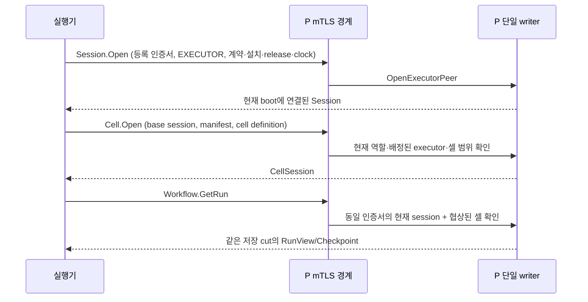

# 실행기 세션·재접속·Run 조회

상태: P의 인증된 실행기 등록과 `Workflow.GetRun`, [소재 시도·단계 활성화 요청](EXECUTOR_REQUESTS.md) 연결. 작업을 생성하는 전체 executor client/worker나 자동 복원을 완성한 상태는 아니다.

## 세션과 운전 권한

실행기 세션은 등록된 상대가 누구인지 식별한다. RunMandate/permit 또는 executor가 실제 가동 중이라는 증거와 같지 않다. 새 연결을 만들었다는 이유로 기존 run의 executor 권한을 교체하거나 재개하지 않는다.

`ExecutorPeer`는 principal, session ID, peer boot, 인증 binding, 협상한 cell definition 목록을 저장한다. `Session`은 현재 P runtime boot와 연결된다. Executor와 Host는 별도 서비스 principal을 사용한다. Host 역할을 함께 가진 principal의 새 executor 등록은 거부한다. 브라우저 로그인으로 서비스 세션을 만들지 않는다.

인증 binding은 `RX-EXECUTOR-AUTH-v1` domain과 certificate fingerprint, installation/store generation, release digest를 결합한다. Host의 기존 evidence producer binding을 변경하거나 공유하지 않는다. 같은 principal로 등록된 두 인증서도 상대 인증서가 만든 session ID를 그대로 사용할 수 없다.

## 전이

| 입력 | 세션 처리 | 기존 운전 권한 |
|---|---|---|
| 최초 등록, 기존 세션 없음 | 새 session, 협상 셀 목록 비움 | 새 운전 권한 없음 |
| 같은 boot/binding·현재 활성 session으로 재접속 | 기존 session 반환 | 접속만으로 run 상태 변경 없음 |
| 같은 Open을 commit 후 응답 유실로 재요청 | 같은 영속 session 회수 | 중복 철회/epoch 증가 없음 |
| 실행기 boot 변경 | 이전 session 철회, 이전 boot tombstone, 새 session | 해당 실행기의 셀과 공유 자원 영향 범위 철회 |
| 인증 binding 변경 | 이전 session 철회, 새 session | 기존 권한 철회, 셀 계약 재협상 필요 |
| 폐기된 boot의 늦은 Open | 거부 | 최신 세션을 밀어내지 않음 |
| P restart | 과거 runtime session 사용 거부. 현재 실행기의 같은 boot도 새 P session 필요 | P restart의 기존 권한 철회를 유지 |

전이는 한 repository transaction이다. legacy/local 방식으로 발급된 해당 principal의 활성 session도 새 executor 등록 시 철회한다. 새 session, 이전 세션 비활성화, boot tombstone, cell/run/mandate 변경과 fence 기록이 함께 commit 또는 rollback된다.

초기 등록 때 기존 session이나 peer가 없으면 불필요한 cell 철회를 만들지 않는다. 기존 세션을 교체하는 경우에는 관련 셀을 단순히 로그인 상태로 취급하지 않고 명시적 재시작 판단 대상으로 남긴다.

`retiredexecutorboot`는 저장소 재개방 후에도 유지한다. P 재시작 때문에 과거 E boot가 다시 최신 실행기를 대체하게 만들지 않는다. 현재 E boot가 동일한 P 재접속과 이미 폐기된 E boot를 구별한다.

## 실제 RPC 경로

- `PlatformIngress`가 Session/Cell/Evidence 및 현재 활성화한 Workflow 메서드를 같은 writer에 연결한다. 이전 `EvidenceIngress` 이름은 소스 호환 alias다.
- Session.Open은 Host와 Executor만 받으며 body role을 현재 principal의 권한으로 다시 확인한다. Executor의 별도 journal handshake는 아직 제공하지 않으므로 journal 필드를 포함한 E hello는 거부한다.
- Cell.Open은 해당 base session이 실제 Host producer인지 ExecutorPeer인지 확인한다. body에 role을 추가해 선택하는 방식이 아니다.
- Executor의 CellDefinition은 현재 계정 셀 범위와 `CellConfiguration.executor` 배정까지 일치해야 한다. 같은 digest에 여러 셀이 모호하게 대응하면 거부한다.
- GetRun은 조회용 CallContext와 run ID를 받는다. 생성용 recipe/site digest와 expected revision은 거부한다.
- 인증서/session 관계는 통신 경계에서 확인한다. 현재 session·역할·셀 범위·현재 definition 협상과 실제 checkpoint 무결성은 writer의 조회 transaction에서 다시 확인한다.
- HTTP와 gRPC는 같은 저장 Snapshot 및 frozen RunView 변환을 사용한다. HTTP cookie를 executor의 인증 수단으로 전환하지 않는다.

다른 인증서, 폐기된 session, 협상하지 않은 셀, 같은 계정 범위이지만 다른 executor에게 배정된 셀은 조회를 거부한다. 조회 성공이 RunView의 executor session을 호출자의 새 session으로 바꾸지 않는다.

## 미완료 경계

현재 Workflow의 Create/Start/Abandon은 명시적으로 UNIMPLEMENTED다. [CommitCheckpoint](CHECKPOINT_COMMIT.md)는 P 준비 상태의 CAS 확정으로 연결했다. ResolveActivation, Cell.BeginPartAttempt와 [Cell.SubmitOperation의 유한 작업 및 Operation.Get](EXECUTOR_SUBMISSION.md)은 실제 typed command/transaction에 연결했다. 실제 C++ Frame 공급자·유한 작업/Pause/인계 요청 worker와 pending key의 영속 복원을 연결했다. 분기/대기 worker는 연결했으며 상주 프로세스와 전체 재시작은 후속이다.

GetRun이 반환하는 artifact 참조의 원격 확보/로컬 공급 경로도 후속이다. 현재 artifact bytes의 HTTP 조회는 사람 사용자의 로컬 BFF 기능이며, 이를 E의 service credential 경로로 사용하지 않는다.

Session 등록의 현재성은 통신 liveness/readiness가 아니다. 서비스 session의 수명은 P/peer incarnation에 묶여 있으며, socket 종료만으로 DB session을 자동 종료하는 monitor/heartbeat는 아직 제공하지 않는다. 이 세션만으로 현장 Start readiness를 충족했다고 판단하면 안 된다. 실행기 disconnect 판단·진행 중 작업 조정·새 시작 승인 및 본격적인 mutation binding을 함께 완성해야 한다.

등록 인증서 목록의 제품 관리 UI·회수/rotation 절차·감사, 전체 원장 snapshot/subscribe, 장기 run checkpoint 용량/index/retention도 미완료다. 이 listener는 두 제품 이미지의 상주 프로세스와 자동 연결된 상태가 아니다.

## 시험

- 실제 writer/SQLite의 session 교체 직전 rollback과 commit 후 응답 유실.
- 같은 peer Open의 session ID/epoch 불변, 변경된 boot의 기존 Run 권한 철회, 폐기된 boot의 재진입 거부.
- P 저장소 재개방 뒤 이전 session·retired boot 거부, 같은 현재 E boot의 새 P session/셀 재협상, RECOVERY_REQUIRED 유지.
- 실제 TLS socket: 등록 인증서·base/cell 양쪽 manifest·셀 배정 확인 전 GetRun 거부.
- body의 HOST 역할 사칭, 미등록 인증서, 동일 principal의 다른 인증서에 의한 session 재사용 거부.
- frozen RunView/Checkpoint 조회, 새 E boot 뒤 기존 session 거부, 재협상 없이 조회 거부, 자동 EXECUTING 전이 없음.
- 기존 Host 증거/작업 E2E의 회귀 시험.

새 실행기 시험은 장비 명령을 전송하지 않는다. Host 회귀 시험의 명시적 simulation 효과와 물리 장비 검증을 구별한다.

명시적 executor halt의 [PauseRun](EXECUTOR_PAUSE.md)을 current session/run CAS와 영속 key에 연결했다. 정상 wait/일시적 조회 지연을 pause로 바꾸지 않는다.
