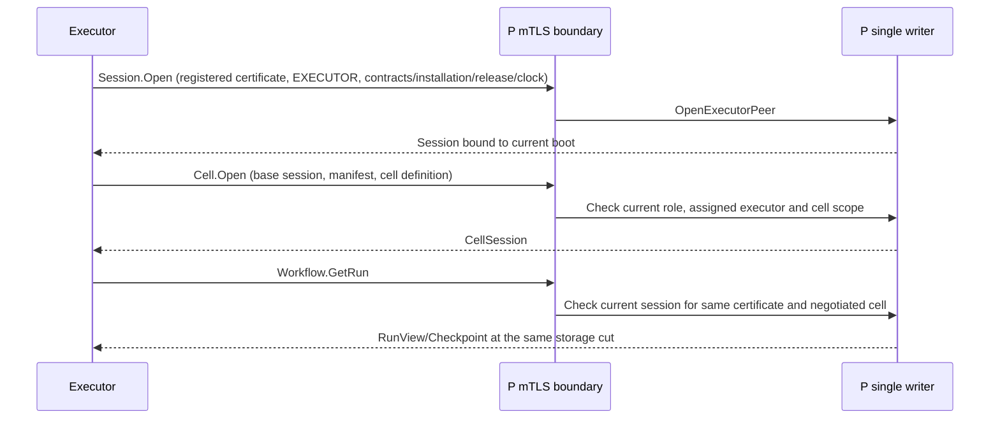

# Executor sessions, reconnection and Run reads

Status: connected P's authenticated executor registration, `Workflow.GetRun` and [part-attempt/activation requests](EXECUTOR_REQUESTS.md). The complete executor client/worker that creates operations and automatic recovery are not finished.

## Sessions and operating authority

An executor session identifies a registered peer. It is not a RunMandate/permit or evidence that the executor is actually running. A new connection does not replace or resume executor authority for an existing run.

`ExecutorPeer` stores principal, session ID, peer boot, authentication binding and negotiated cell definition list. `Session` binds to the current P runtime boot. Executor and Host use separate service principals. New executor registration is rejected for principals that also have the Host role. Browser login does not create a service session.

Authentication binding combines the `RX-EXECUTOR-AUTH-v1` domain, certificate fingerprint, installation/store generation and release digest. It does not change or share the Host's existing evidence producer binding. Even two certificates registered to the same principal cannot reuse the session ID created by the other certificate.

## Transitions

| Input | Session handling | Existing operating authority |
|---|---|---|
| Initial registration, no existing session | New session, empty negotiated cell list | No new operating authority |
| Reconnect with the same boot/binding/current active session | Return existing session | Connection alone does not change run state |
| Retry the same Open after a lost post-commit response | Recover the same durable session | No duplicate revocation/epoch increment |
| Executor boot change | Revoke previous session, tombstone previous boot, create new session | Revoke the executor's cells and shared-resource impact scope |
| Authentication binding change | Revoke previous session, create new session | Revoke existing authority; cell contracts must be renegotiated |
| Late Open from a retired boot | Reject | Does not displace the latest session |
| P restart | Reject historical runtime sessions. Even the current executor's same boot needs a new P session | Preserve existing authority revocation caused by P restart |

The transition is one repository transaction. New executor registration also revokes active sessions issued to that principal by legacy/local paths. The new session, previous-session deactivation, boot tombstone, cell/run/mandate changes and fence records commit or roll back together.

If no existing session or peer exists at initial registration, no unnecessary cell revocation is created. When replacing an existing session, related cells are left subject to an explicit restart decision rather than being treated merely as login state.

`retiredexecutorboot` survives store reopening. P restart does not allow an old E boot to replace the latest executor again. Reconnection to P by the same current E boot is distinguished from an already retired E boot.

## Actual RPC path

- `PlatformIngress` connects Session/Cell/Evidence and currently enabled Workflow methods to the same writer. The previous `EvidenceIngress` name is a source-compatible alias.
- Session.Open accepts only Host and Executor and rechecks the body role against current principal privileges. Executor has no separate journal handshake yet, so an E hello containing journal fields is rejected.
- Cell.Open checks whether the base session is an actual Host producer or ExecutorPeer. It is not selected by adding a role to the body.
- An Executor's CellDefinition must match current account cell scope and the `CellConfiguration.executor` assignment. Ambiguous mapping of the same digest to multiple cells is rejected.
- GetRun takes a read CallContext and run ID. Creation recipe/site digests and expected revision are rejected.
- The certificate/session relationship is checked at the transport boundary. Current session/role/cell scope/current definition negotiation and actual checkpoint integrity are rechecked in the writer's read transaction.
- HTTP and gRPC use the same stored Snapshot and frozen RunView conversion. An HTTP cookie is not converted into executor authentication.

Reads are rejected for another certificate, a retired session, an unnegotiated cell or a cell in the same account scope but assigned to another executor. Successful reads do not replace RunView's executor session with the caller's new session.

## Incomplete boundaries

Workflow Create/Start/Abandon are currently explicitly UNIMPLEMENTED. [CommitCheckpoint](CHECKPOINT_COMMIT.md) is connected as a CAS commit of state prepared by P. ResolveActivation, Cell.BeginPartAttempt and [Cell.SubmitOperation finite operations and Operation.Get](EXECUTOR_SUBMISSION.md) are connected to actual typed commands/transactions. The actual C++ Frame provider, finite-operation/Pause/handover request workers and durable pending-key recovery are connected. Branch/wait workers are connected; the resident process and complete restart remain follow-up work.

Remote acquisition/local supply of artifact references returned by GetRun also remains follow-up work. Current HTTP artifact-byte reads are a human user's local BFF feature, not E's service-credential path.

Current session registration is not transport liveness/readiness. Service-session lifetime binds to P/peer incarnation; no monitor/heartbeat yet automatically closes a DB session when a socket closes. This session alone must not be considered to satisfy field Start readiness. Executor disconnect detection, reconciliation of ongoing operations, new-start approval and full mutation bindings must be completed together.

Product management UI/revocation/rotation procedures/auditing for registered certificates, full journal snapshot/subscribe, and long-run checkpoint capacity/indexing/retention also remain incomplete. This listener is not automatically connected to resident processes in the two product images.

## Tests

- Rollback immediately before session replacement and lost response after commit using actual writer/SQLite.
- Unchanged session ID/epoch for the same peer Open, revocation of existing Run authority after boot change, and rejection of retired-boot re-entry.
- Rejection of previous sessions/retired boots after P store reopening, new P session/cell renegotiation for the same current E boot, and preservation of RECOVERY_REQUIRED.
- Actual TLS socket: GetRun rejected before registered certificate/base and cell manifests/cell assignment are verified.
- Rejection of HOST role impersonation in the body, unregistered certificates and session reuse by a different certificate of the same principal.
- Frozen RunView/Checkpoint reads, old-session rejection after new E boot, reads rejected without renegotiation, and no automatic EXECUTING transition.
- Regression tests for existing Host evidence/operation E2E paths.

New executor tests send no device commands. Explicit simulation effects in Host regression tests are distinguished from physical device validation.

[PauseRun](EXECUTOR_PAUSE.md) for explicit executor halt is connected to current session/run CAS and a durable key. Normal waits/temporary read delays are not converted into pauses.
