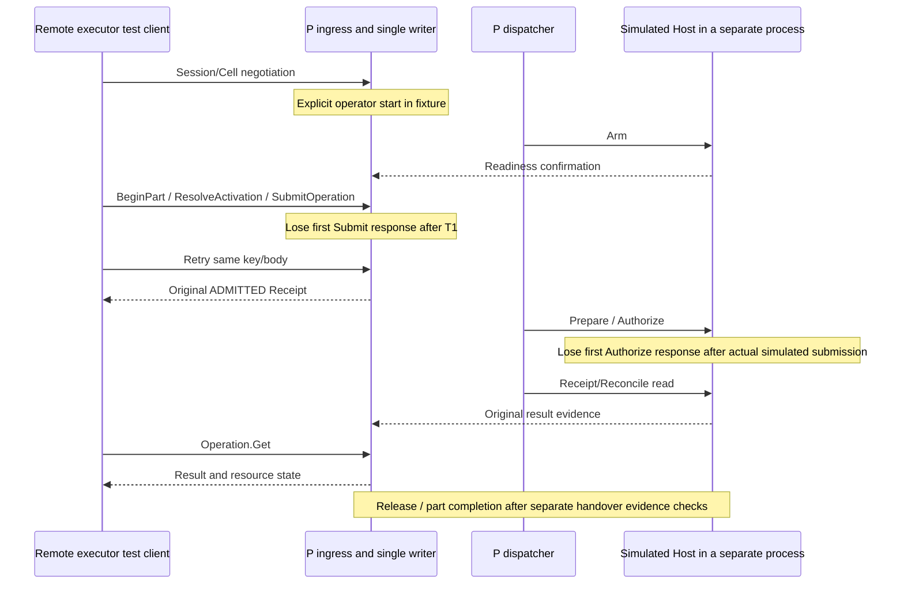

# Executor finite-operation submission and current operation reads

Status: actual E → P mTLS admission and the P → H dispatcher/simulated-device path are connected. This does not mean completion of the full BT worker, continuous control, recovery submission, field qualification or product deployment.

## External request

`Cell.SubmitOperation` requires a currently authenticated executor session and CellDefinition negotiation. The adapter interprets frozen cell/base messages and forwards an `ExecutorSubmitRequest`.

| Input | Check |
|---|---|
| Outer CellCall and nested base CallContext | Session ID, call ID and request key must match. base expected_revision must be absent in both |
| cell ID | Must match current account cell scope/negotiated definition/actual executor assignment and run membership |
| run / activation / slot | Match P's actual activation mapping. Check the main slot and verified step Intent for a new operation |
| part_attempt_id | Match the activation's actual part relationship. Existing domain checks apply PRODUCTION/SETUP rules |
| parent mandate | Match the current run mandate for a new slot; match the permit parent recorded for the operation for an existing slot |
| expected_cell_revision / expected_run_revision | Required positive values. Check both CAS values in the same T1 when allocating a new slot |
| intent | Existing strict codec and domain normalization, including profile/site/program/parameter/resource/completion/cancellation rules |

Current public submission is the finite-operation path under a run mandate. `RecoveryStepRef` and continuous `CONTROL_SESSION` submissions are rejected until their lifecycles are implemented. They are not downgraded to ordinary finite operations. Original continuous-control/recovery implementation requirements remain outstanding.

## Authentication, duplicate recovery and new admission

1. The writer rechecks current executor session/role/negotiated cell/assignment.
2. Compare run/activation/part/cell relationships and the complete typed request payload/key. Mandate and both CAS values are included in the business fingerprint; authentication session/call trace IDs are excluded.
3. The same key/body recovers the stored operation. A different body yields KEY_CONFLICT/ALREADY_EXISTS. Recovery is neither native reexecution nor a new permit issuance.
4. An existing slot with a new key recovers the existing operation after checking Work/Operation/Permit ID/run/cell/activation/part/slot/intent/parent relationships.
5. New slots undergo current RunMandate/qualification/block/conditions/observations/budget/Host/grant/resource/CAS checks. They use the same `submit_transition` as the existing trusted-composition path.
6. Work/slot/permit/resource/outbox/request result/journal/checkpoint and the [initial admission receipt](ADMISSION_RECEIPT.md) commit in one T1.

No additional admission path was created separately from new operation creation. Public base Operation.Submit is not enabled in this installation, so it cannot bypass cell/parent/condition checks. Lost Cell.SubmitOperation responses are recovered through the same cell request; base Operation.Lookup is not repurposed as another method's cache read.

## Response semantics

The public response is the initial ADMITTED Receipt stored with T1. Even if subsequent Host PREPARED/SEND_ENTERED/completion arrives quickly, the initial response's stage/revision/journal position is not changed to that later state.

P application reads and returns the immutable receipt after T1. Failure of this final read or transmission does not undo the already committed T1. The caller preserves the same key/body for recovery. Tests verify this path by losing the first response after actual commit.

Current `Operation.Get` checks the executor's current access and cell negotiation and returns the OperationView stored in P. The read itself does not cause Native Reconcile, cancellation, resource release or reexecution.

## OperationView

Phase, execution knowledge, outcome, integrity, disposition and evidence IDs are preserved separately. If Work's Intent differs from the digest fixed in Operation, the read is rejected with DATA_LOSS. Continuous-control state is not filled with arbitrary defaults for finite operations.

- UNKNOWN is shown as absent/unknown result and quarantine state; it is not changed to FAILED or success.
- Even SUCCEEDED is not shown as RELEASED without handover evidence.
- Later contradictory evidence does not erase the existing outcome; it is delivered with DISPUTED/QUARANTINED.
- Reason conveys additional uncertainty/integrity problems. OK alone is not a success judgment; the actual result is read from outcome.
- P's current cancellation lifecycle/continuous-control state model is not yet implemented. It is not presented as providing those wire features.

## Actual transport tests

The new third scenario in `tools/test_host_e2e.sh` uses actual TLS for both E → P and P → H. E's first Submit response and H's first Authorize response are lost after commit/actual simulated submission, respectively. It verifies that Authorize calls and simulated effects each occur only twice for two parts, same-key Receipts are identical, and P result reads/handover/budget exhaustion lead through Run completion.

Simulated effect counts are read from `device/effects.jsonl` written by the separate Host, not inferred only from P outcomes. When inspecting internal state after success appears on the public wire, snapshots from different times are not assumed to represent the same instant.

Operator assignment/start, initial qualification/ready facts and subsequent resource-handover/part-completion calls still use explicit test-composition paths. The new client is a test-only Rust client and does not replace the product C++ BT worker. This is not validation of actual field operator terminals, robots, PLCs, fixtures or grippers.

## Additional counterexamples and remaining connections

Core tests verify incorrect mandate/part/cell revision, failure immediately before T1/lost response after commit, changed same-key bodies, existing slots with new keys, original Receipt recovery after Hold and rejection after role revocation. API tests verify nested-context mismatch, another run/part/parent, stale run CAS, same-request recovery with a new call trace ID and rejection of base Submit bypass. Projection tests compare the independent states for UNKNOWN, handover after conclusion and late contradiction.

P branch/wait and CommitCheckpoint release schema/CAS, C++ Frame/finite-operation/Pause/handover workers/durable pending keys and artifact acquisition were connected in later stages. S branch/wait workers are connected too. Remaining work is complete restart, the complete public journal, cancel/recovery/control-session, service liveness, long-run capacity/indexing, UI, the project's two images and installation/restoration/acceptance. This finite-operation path is not expanded into a claim of complete product support or field automatic recovery.

S's durable finite-operation worker connects actual C++ requests to this P submission path. The [request journal and worker](https://github.com/jack0682/rx-solutions/blob/codex/initial-draft/runtime/rx-executor/JOURNAL_AND_WORKER.md) distinguishes local lost-response/restart boundaries from the incomplete full daemon/remaining requests.
