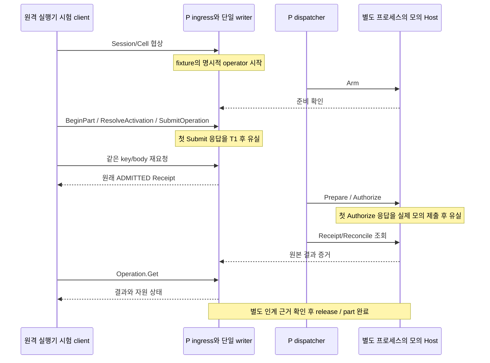

# 실행기의 유한 작업 제출과 현재 작업 조회

상태: 실제 E→P mTLS admission과 P→H dispatcher/모의 장비 경로를 연결했다. 전체 BT worker, 연속 제어, 복구 제출, 현장 qualification 또는 제품 배포 완료를 뜻하지 않는다.

## 외부 요청

`Cell.SubmitOperation`은 현재 인증된 executor session과 CellDefinition 협상을 요구한다. adapter는 frozen cell/base 메시지를 해석해 `ExecutorSubmitRequest`로 전달한다.

| 입력 | 검사 |
|---|---|
| 외부 CellCall와 nested base CallContext | session ID, call ID, request key가 같아야 함. base expected_revision은 양쪽 모두 absent |
| cell ID | 현재 계정 셀 범위·협상한 definition·실제 executor 배정, run 소속과 일치 |
| run / activation / slot | P의 실제 activation mapping과 일치. 새 작업의 main slot과 검증된 step intent를 확인 |
| part_attempt_id | activation의 실제 part 관계와 일치. PRODUCTION/SETUP 규칙은 기존 domain 검사 적용 |
| parent mandate | 신규 slot은 현재 run mandate, 기존 slot은 그 작업에 기록된 permit parent와 일치 |
| expected_cell_revision / expected_run_revision | 필수 양수. 새 slot을 할당할 때 두 CAS를 같은 T1에서 확인 |
| intent | 기존 strict codec 및 domain normalization. profile/site/program/parameter/resource/완료·취소 규칙 포함 |

현재 공개 제출은 run mandate에 속한 유한 작업 경로다. `RecoveryStepRef` 및 연속 `CONTROL_SESSION` 제출은 해당 수명주기 구현 전까지 거부한다. 이를 일반 finite 작업으로 낮추어 처리하지 않는다. 원래 연속 제어·복구 구현 요구는 그대로 남는다.

## 인증·중복 회수·새 admission

1. writer가 현재 executor session/역할/협상한 셀/배정을 다시 확인한다.
2. run/activation/part/cell 관계를 대조하고 전체 typed 요청 payload와 key를 비교한다. mandate 및 두 CAS도 업무 fingerprint에 포함한다. 인증용 session/call trace ID는 제외한다.
3. 같은 key/body면 저장된 작업을 회수한다. 다른 body면 KEY_CONFLICT/ALREADY_EXISTS다. 이 회수는 native 재실행이나 새 permit 발급이 아니다.
4. 새 key의 기존 slot은 Work/Operation/Permit의 ID·run·cell·activation·part·slot·intent/parent 관계를 검사한 뒤 기존 작업을 회수한다.
5. 새 slot에는 현재 RunMandate/qualification/block/조건·관측/예산·Host/grant/resource/CAS 검사를 적용한다. 기존 trusted composition 경로와 같은 `submit_transition`을 사용한다.
6. Work·slot·permit·resource·outbox·요청 결과·원장·checkpoint와 [최초 접수 확인서](ADMISSION_RECEIPT.md)를 한 T1에 commit한다.

새 작업과 별도로 추가 접수 경로를 만들지 않았다. 공개 base Operation.Submit은 이 설치에서 활성화하지 않아 cell/parent/조건 검사를 우회할 수 없다. Cell.SubmitOperation의 유실 응답은 같은 cell request로 회수하며, base Operation.Lookup을 다른 method의 cache 조회로 전용하지 않는다.

## 응답의 의미

공개 응답은 T1과 함께 저장된 최초 ADMITTED Receipt다. 이후 Host PREPARED/SEND_ENTERED/완료가 빨리 도착했어도 최초 응답의 stage·revision·journal 위치를 그 후의 상태로 바꾸지 않는다.

P application은 T1 뒤 immutable receipt를 읽어 반환한다. 이 마지막 읽기나 전송이 실패해도 이미 commit한 T1은 취소되지 않는다. caller는 같은 key/body를 보존해 회수한다. 테스트는 실제 commit 후 첫 응답을 유실시켜 이 경로를 확인한다.

현재 `Operation.Get`은 해당 executor의 현재 접근권·셀 협상을 확인하고 P에 저장된 OperationView를 반환한다. read 자체가 Native Reconcile, cancel, 자원 release 또는 재실행을 일으키지 않는다.

## OperationView

phase·execution knowledge·outcome·integrity·disposition·evidence IDs를 각각 보존한다. Work의 intent와 Operation에 고정된 digest가 다르면 DATA_LOSS로 거부한다. 유한 작업에 연속 control state를 임의 기본값으로 채우지 않는다.

- UNKNOWN은 결과 없음/불명과 격리 상태로 표시하며 FAILED나 성공으로 바꾸지 않는다.
- SUCCEEDED여도 인계 근거가 없으면 RELEASED로 표시하지 않는다.
- 나중에 모순된 증거가 도착하면 기존 outcome을 지우지 않고 DISPUTED/QUARANTINED와 함께 전달한다.
- Reason은 추가적인 불명/무결성 문제를 알린다. OK만으로 성공을 판단하지 않으며 실제 결과는 outcome에서 읽는다.
- 현재 P의 cancel 수명주기·연속 제어 상태 모델은 아직 구현되지 않았다. 해당 wire 기능을 제공한다고 표시하지 않는다.

## 실제 통신 시험

`tools/test_host_e2e.sh`의 새 세 번째 시나리오는 E→P와 P→H 양쪽에 실제 TLS를 사용한다. E의 첫 Submit 응답과 H의 첫 Authorize 응답을 각각 commit/실제 모의 제출 후 잃게 한다. 두 part에 Authorize 호출·모의 효과가 각각 두 번만 발생하고, 같은 key의 Receipt가 동일하며, P 결과 조회·인계·예산 소진 후 Run 완료까지 이어지는지 확인한다.

모의 효과 수는 P의 outcome만으로 추정하지 않고 별도 Host가 기록한 `device/effects.jsonl`에서 확인한다. 공개 wire에서 성공이 보인 뒤 내부 상태를 확인할 때는 다른 시점의 snapshot을 동일 시각이라고 가정하지 않는다.

operator assignment/start, 초기 qualification/ready fact, 자원 인계·part 완료의 후속 호출은 아직 명시적 test composition 경로다. 새 client는 test-only Rust client이며 제품 C++ BT worker를 대신하지 않는다. 실제 현장의 작업자 단말·로봇·PLC·지그·그리퍼를 검증한 시험이 아니다.

## 추가 반례와 남은 연결

core 시험은 잘못된 mandate/part/cell revision, T1 직전 실패·commit 후 응답 유실, 바뀐 같은 key, 새 key의 기존 slot, Hold 뒤 원래 Receipt 회수와 역할 회수 거부를 검증한다. API 시험은 중첩 context 불일치, 다른 run/part/parent, stale run CAS, 새로운 call trace ID로 동일 요청 회수와 base Submit 우회 거부를 검증한다. projection 시험은 UNKNOWN·결론 후 인계·후발 모순의 독립 상태를 대조한다.

P branch/wait 및 CommitCheckpoint의 release schema/CAS, C++ Frame·유한 작업/Pause/인계 worker·영속 pending key, artifact 확보는 후속 단계에서 연결했다. S 분기/대기 worker도 연결했다. 남은 것은 전체 재시작, 전체 공개 원장, cancel/recovery/control-session, 서비스 liveness, 장기 run 용량/index, UI·자사 두 이미지·설치/복원/인수다. 이 유한 작업 경로를 전체 제품 지원 또는 현장 자동 복구 완료로 확대하지 않는다.

S의 영속 유한 worker가 실제 C++ 요청을 이 P 제출 경로에 연결한다. [요청 journal과 worker](https://github.com/jack0682/rx-solutions/blob/codex/initial-draft/runtime/rx-executor/JOURNAL_AND_WORKER.md)는 local 응답 유실/재시작 경계와 아직 미완료인 전체 daemon·나머지 요청을 구별한다.
