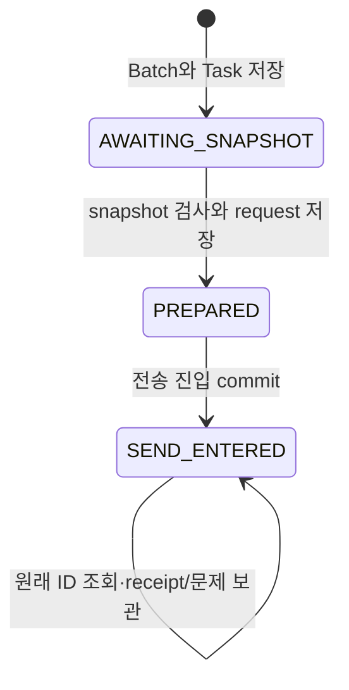

# Host 공정 문맥 변경의 영속 조정

상태: 구현 초안. phase50 전송 경계, phase51 적용 연결. P `configuration_dispatch`, Runtime writer/Host worker, browser API에 해당한다. [변경 계획](PROCESS_CHANGE.md)과 [S Host 계약](https://github.com/jack0682/rx-solutions/blob/codex/initial-draft/runtime/rx-host/PROCESS_CONFIGURATION.md)을 연결한다.

## 제공하는 기능과 효과의 범위

현재 등록 단말의 ReleaseManager가 STAGED 변경의 Host 전송을 명시적으로 요청한다. P는 영향 Host마다 요청 번호를 먼저 보관하고, 인증된 Host snapshot과 정확한 요청 본문을 연결한 뒤 전송한다. 응답 유실에는 원래 번호를 조회한다. 같은 요청에 대해 확인한 receipt는 영속 사실이고, 현재 준비에 사용 가능한지는 별도 판정이다.

Host가 변경하는 것은 공정 문맥 metadata다. `APPLIED_UNQUALIFIED` receipt는 PLC/로봇 설정이 변경됐다는 뜻이 아니다. 이 Host 전송 단계는 P의 active CellConfiguration을 교체하지 않는다. 후속 [P 적용](PROCESS_APPLY.md)이 이를 별도 수행하며 qualification/운전 허가를 생성하거나 CONFIGURATION_CHANGE block을 해제하지 않는다.

## 저장 모델

| 저장 대상 | 동일성·의미 |
|---|---|
| Batch | 명시적 사용자 요청 key/body → change/preparation 및 task ID 목록. 전체가 한 transaction |
| Task slot | `(change, preparation attempt, host)`당 하나의 Task ID |
| Task | origin/plan digest, 전체 Host 셀 cohort, P boot, Host boot/journal/producer session, 송신 승인 계정·세션·단말 |
| Bound request | 검토된 before/after configuration, recipe, intent/condition 요구, 현재 epoch/scope, 정확한 fence, Host binding hash와 expected context |
| Receipt | Host의 원래 request/digest/sequence/status/effect/기록 시각. 첫 확인 이후 덮어쓰지 않음 |
| Observation/Issue | 가장 최근 인증 응답 또는 통신/권한/문맥 문제. receipt 사실과 별도 |

Task 변경과 사건 기록은 P의 기존 SQLite writer transaction을 사용한다. request key 회수는 현재 사용자 권한을 확인한 뒤 원래 Batch를 돌려준다. 새 사용자 key로 같은 slot을 요청해도 새 Task를 만들지 않는다. 아직 receipt가 없는 task의 송신 승인자만 명시적으로 갱신할 수 있다. 이미 고정한 Host 세대와 request 본문은 그대로다.

## 상태 전이와 실패 경계



전송 상태의 SEND_ENTERED와 결과 APPLIED_UNQUALIFIED/NOT_APPLIED는 다른 축이다. 결과를 받았다고 전송 이력을 지우지 않는다. RETIRED는 예약 상태이며 현재 공개 취소/retire API는 없다.

1. Task 저장 전 실패: Host 호출 없음. 같은 사용자 key로 다시 요청할 수 있다.
2. Task 저장 후 API 응답 유실: 같은 key가 기존 Task 목록을 회수한다.
3. request 저장 또는 전송 진입 commit 실패: worker에 전송 명령을 반환하지 않는다.
4. 전송 진입 commit 후 응답/프로세스 상실: Task는 SEND_ENTERED로 남는다. 다음 worker는 같은 ID를 조회한다.
5. Host commit 뒤 RPC 응답 유실: P는 미확인으로 남고, Lookup이 원래 receipt를 회수한다.
6. Lookup에 receipt 없음: NOT_APPLIED로 추정하지 않는다. 동일한 Host boot/journal/binding 및 예상 문맥·전체 cohort·block 상태를 대조한다.
7. 첫 receipt 이후 receipt가 사라지거나 내용이 달라짐: 원래 receipt를 보존하고 integrity_disputed를 latch한다. 뒤늦게 같은 receipt가 와도 자동 해제하지 않는다.

이 확장의 효과는 동일 ID에 대해 원자적이고 멱등적인 Host metadata 기록이다. 따라서 아직 receipt가 없고, 인증된 같은 세대의 Lookup과 현재 P의 모든 송신 조건을 다시 통과한 경우에만 **정확히 같은 request**의 재전송을 허용한다. 이 규칙을 물리 작업/native 명령의 재전송에 적용하지 않는다. 다른 boot 또는 journal에서 새 ID를 만들어 같은 일을 다시 수행하지 않는다.

## 송신 전에 확인하는 조건

- 현재 ReleaseManager 계정/세션/등록 단말과 영향 셀 접근 범위.
- STAGED 상태, review approval·plan digest·구성 참조, 같은 preparation/P Runtime boot.
- 모든 영향 셀의 preparation epoch/scope와 latched 변경 block.
- 영향 범위의 Run은 COMPLETED/ABANDONED, work는 결과 미확정/무결성 논쟁 없음.
- 관련 resource의 holder/quarantine 없음, 관련 열린 개입 사건 없음.
- 모든 준비 fence의 정확한 message ID/epoch/scope와 현재 Host boot/journal에 대한 ack.
- 한 Host에 속한 모든 셀의 registration이 같은 boot/journal/producer session을 가리킴.
- snapshot은 조회 시작부터 3초 이내이며 Host 전체 cohort, definition/envelope/environment, epoch/scope/block과 예상 구성 문맥이 일치함.

위 조건은 P가 가진 상태의 검사다. 장비가 실제로 가만히 있다는 주장을 대체하지 않는다. S Host는 Apply에서 자체 unresolved delivery와 adapter quiescence를 다시 확인한다. 이 기록 시점 이후의 지속 물리 안정성을 보증하지 않는다.

역할 회수나 preparation 변경은 **새 송신**을 막는다. 이미 전송한 요청의 늦은 receipt는 현재 인증된 해당 Host가 제공하면 사실로 남긴다. 과거 사실 보관을 현재 운전 허가와 혼동하지 않는다.

## 조회·집계

`GET /api/v1/process-change`의 `host_configuration`에 다음을 제공한다.

- Host별 task ID/preparation/phase/outcome/issue/integrity_disputed.
- `acknowledged_for_preparation`: 현재 준비·Host registration·응답 문맥과 일치하고 문제/분쟁 없는 APPLIED_UNQUALIFIED 기록.
- `outcome_unknown`: SEND_ENTERED이면서 receipt를 아직 확보하지 못한 Host가 있음.
- `mixed_configuration`: 전체 Host 중 일부에만 target 적용 receipt가 알려짐. 현재 물리 구성이 확정적으로 섞였다는 센서 판정은 아니다.
- `all_hosts_acknowledged`: 모든 영향 Host에 대한 위 확인을 확보함. 전체 P 적용/qualification 완료가 아님.
- STAGED의 전송 조회는 `revalidation_required_before_platform_apply=true`, `platform_configuration_applied=false`. 별도 P 적용 이후의 역사 표시는 [적용 명세](PROCESS_APPLY.md)를 따른다.

새 preparation에 task가 아직 없으면 마지막 이전 task도 집계에 표시한다. refresh만으로 이전 미확정 전송이나 이미 확인한 효과를 숨기지 않는다. 이전 attempt의 미확정/분쟁 SEND_ENTERED가 있으면 새 Batch를 만들지 못한다.

집계는 저장된 마지막 응답에 대한 문맥 판정이며 지속 연결/freshness 보증이 아니다. 실제 P 적용은 별도의 fresh barrier가 필요하다. P 적용은 이 Boolean만 사용하지 않고 현재-process freshness proof와 권한·장벽·패키지 검증을 다시 확인한다. 재개는 별도 재검증 단계다.

## 프로세스·API 경계

`POST /api/v1/process-change/configure-hosts`

```json
{
  "request_key": "<UUID>",
  "command": {
    "change": "<UUID>",
    "cell": "<cell ID>",
    "expected": "<change revision>",
    "plan_digest": "<64 hex digest>"
  }
}
```

기존 cookie/CSRF/terminal BFF 인증을 사용한다. API는 Host와 직접 통신하지 않고 P writer에 Batch 생성을 요청한다. Host Task/송신 명령은 내부 ApplicationPort에만 있고 browser에 장비 통신 권한을 제공하지 않는다.

ConnectionService는 인증된 HostClient/Identity를 dispatcher·observation reader와 configuration worker에 공유한다. worker는 최대 16개씩 조회하고 500ms 주기로 진행하며 큰 목록은 cursor로 순회한다. 네트워크 대기는 writer 밖이다. 현재 attempt의 적용 기록은 재조회하여 문맥 상실을 보며, 이전 settled task·확인된 NOT_APPLIED·분쟁 task는 자동 전송 대상에서 제외한다. 이전 unknown send는 계속 조회할 수 있다.

소유 서비스의 stop 또는 소멸은 진행 중 worker future도 중단한다. 이미 writer에 들어간 transaction이나 이미 Host로 전송된 RPC의 취소 성공을 의미하지 않는다. durable SEND_ENTERED/receipt가 후속 확인 기준이다. 저장 오류를 권한 거부로 바꾸지 않고 상위 서비스에 전달한다.

## 현재 지원 한계

- 전체 cohort는 최대 64셀이다. frozen CellHello는 definition digest로 셀을 찾으므로 같은 Host 안에 동일 definition digest가 여러 셀에 쓰인 cohort는 현재 거부한다. v1 계약을 느슨하게 바꾸지 않았다.
- worker는 한 인증 Host session에서 모든 cohort 셀을 open한다. 별도 ConnectionService를 여러 개 띄워 같은 Host 세션을 경쟁시키는 배포는 이 기능으로 검증되지 않았다. 정상 multi-cell Host connection 배치/세션 소유권은 후속이다.
- 현재 목록·barrier는 document scan이다. 16개 출력 제한은 전체 DB scan 비용을 제한하지 않는다. 인덱스·보관 주기·운영 부하 한도는 후속이다.
- CPU/GPU/ROS driver 재구성, 물리 모드 전이, 적용 취소·rollback, Host requalification 해제, 변경 전용 UI는 미완료다.
- 확인된 NOT_APPLIED는 같은 task를 다시 적용하지 않는다. 새 준비의 명시적 계획을 거쳐야 한다. 이전 unknown/dispute 해소에는 사실 확인 경로가 필요하며 결과를 임의로 미적용 처리하는 API는 없다.

## 검증 범위

검증 결과는 [phase50 기록](https://github.com/jack0682/rx_docs/blob/6111a7d1dcf33052f38c3e67c6585aec2b44df3c/references/implementation/phase50_checks.json)에 둔다. 원장 시험은 commit 전 실패/commit 후 응답 유실, 권한 회수, 일부 Host만 확인, receipt 소실/모순, snapshot 변경 및 이전 unknown attempt를 다룬다. 실제 별도 S 모의 Host와의 mTLS 시험은 실제 P writer·검토/준비/Task를 사용해 응답 유실 후 worker 재생성·조회와 P 재시작의 보존을 검사한다. package/report 서명자는 test-only이며 실제 장비나 production signer 시험은 아니다.
