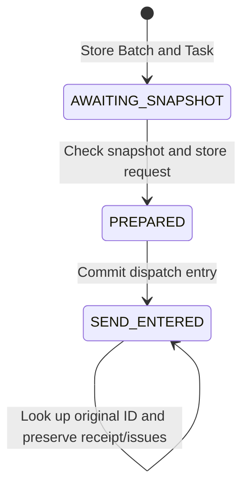

# Durable coordination of Host process-context changes

Status: implementation draft. phase50 transport boundary, phase51 application connection. Covers P `configuration_dispatch`, Runtime writer/Host worker and browser API. Connects [change plans](PROCESS_CHANGE.md) and the [S Host contract](https://github.com/jack0682/rx-solutions/blob/codex/initial-draft/runtime/rx-host/PROCESS_CONFIGURATION.md).

## Features and scope of effects

A ReleaseManager on a currently registered terminal explicitly requests Host dispatch for a STAGED change. P first preserves a request number for each impacted Host, binds an authenticated Host snapshot to the exact request body, then dispatches. A lost response triggers lookup of the original number. A verified receipt for the same request is a durable fact; whether it is usable for current preparation is a separate judgment.

The Host changes process-context metadata. An `APPLIED_UNQUALIFIED` receipt does not mean PLC/robot settings changed. This Host dispatch stage does not replace P's active CellConfiguration. Subsequent [P application](PROCESS_APPLY.md) does that separately, without creating qualification/operating permission or clearing CONFIGURATION_CHANGE blocks.

## Storage model

| Stored item | Identity and meaning |
|---|---|
| Batch | Explicit user request key/body → change/preparation and Task ID list. All in one transaction |
| Task slot | One Task ID per `(change, preparation attempt, host)` |
| Task | Origin/plan digest, complete Host cell cohort, P boot, Host boot/journal/producer session, dispatch-authorizing account/session/terminal |
| Bound request | Reviewed before/after configuration, recipe, Intent/condition requirements, current epoch/scope, exact fence, Host binding hash and expected context |
| Receipt | Host's original request/digest/sequence/status/effect/recorded time. Never overwritten after first confirmation |
| Observation/Issue | Latest authenticated response or transport/authority/context problem. Separate from receipt facts |

Task changes and events use P's existing SQLite writer transaction. Request-key recovery returns the original Batch after checking current user permissions. A new user key for the same slot does not create another Task. Only the dispatch authorizer for a task without a receipt can be explicitly updated. The already fixed Host generation and request body remain unchanged.

## State transitions and failure boundaries



Dispatch state SEND_ENTERED and outcome APPLIED_UNQUALIFIED/NOT_APPLIED are different axes. Receiving a result does not erase dispatch history. RETIRED is reserved; there is currently no public cancellation/retire API.

1. Failure before Task persistence: no Host call. The same user key can be requested again.
2. Lost API response after Task persistence: the same key recovers the existing Task list.
3. Request persistence or dispatch-entry commit failure: no dispatch command is returned to the worker.
4. Lost response/process after dispatch-entry commit: Task remains SEND_ENTERED. The next worker looks up the same ID.
5. Lost RPC response after Host commit: P remains unconfirmed; Lookup recovers the original receipt.
6. No receipt in Lookup: do not infer NOT_APPLIED. Compare the same Host boot/journal/binding, expected context, complete cohort and block state.
7. Receipt disappears or changes after first confirmation: preserve the original receipt and latch integrity_disputed. A later identical receipt does not automatically clear it.

This extension's effect is an atomic, idempotent Host metadata write for the same ID. Therefore, retransmission of the **exact same request** is permitted only while no receipt exists and an authenticated same-generation Lookup plus all current P dispatch conditions pass again. This rule does not apply to retransmission of physical operations/native commands. A new ID is not created in another boot or journal to perform the same work again.

## Pre-dispatch conditions

- Current ReleaseManager account/session/registered terminal and access to impacted cells.
- STAGED status, review approval/plan digest/configuration references, same preparation/P Runtime boot.
- Preparation epoch/scope and latched change blocks for every impacted cell.
- Impacted Runs are COMPLETED/ABANDONED; Work has no unresolved results or integrity disputes.
- No holders/quarantine on related resources and no related open intervention cases.
- Exact message ID/epoch/scope for all preparation fences, acknowledged for the current Host boot/journal.
- Registrations for every cell belonging to one Host reference the same boot/journal/producer session.
- The snapshot is within 3 seconds of read start and matches complete Host cohort, definition/envelope/environment, epoch/scope/block and expected configuration context.

These conditions check state held by P. They do not substitute for evidence that equipment is physically quiet. At Apply, the S Host rechecks its own unresolved deliveries and adapter quiescence. This does not guarantee continued physical stability after the recording instant.

Role revocation or preparation changes block **new dispatch**. Late receipts for already dispatched requests remain facts if supplied by the currently authenticated corresponding Host. Preserving historical facts must not be confused with current operating permission.

## Reads and aggregation

`host_configuration` in `GET /api/v1/process-change` provides:

- Per-Host task ID/preparation/phase/outcome/issue/integrity_disputed.
- `acknowledged_for_preparation`: an APPLIED_UNQUALIFIED record matching current preparation/Host registration/response context, without issues/disputes.
- `outcome_unknown`: at least one Host is SEND_ENTERED without a recovered receipt.
- `mixed_configuration`: target-application receipts are known for only some Hosts. This is not a sensor judgment establishing a mixed current physical configuration.
- `all_hosts_acknowledged`: the above confirmation exists for all impacted Hosts. Not completion of full P application/qualification.
- Dispatch reads while STAGED have `revalidation_required_before_platform_apply=true`, `platform_configuration_applied=false`. Historical display after separate P application follows the [application specification](PROCESS_APPLY.md).

If a new preparation has no tasks yet, aggregation also displays the latest previous tasks. Refresh alone does not hide earlier unconfirmed dispatches or known effects. An unresolved/disputed SEND_ENTERED task from a previous attempt prevents creating a new Batch.

Aggregation judges the context of the last stored response; it does not guarantee sustained connectivity/freshness. Actual P application requires a separate fresh barrier. P application does not rely only on these Booleans: it rechecks current-process freshness proof, authority, barriers and package validation. Resumption is a separate revalidation stage.

## Process and API boundaries

`POST /api/v1/process-change/configure-hosts`

```json
{
  "request_key": "<UUID>",
  "command": {
    "change": "<UUID>",
    "cell": "<cell ID>",
    "expected": "<change revision>",
    "plan_digest": "<64 hex digest>"
  }
}
```

Uses existing cookie/CSRF/terminal BFF authentication. The API does not communicate directly with Hosts; it asks the P writer to create a Batch. Host Tasks/dispatch commands exist only on the internal ApplicationPort and do not give the browser device-communication authority.

ConnectionService shares the authenticated HostClient/Identity among dispatcher, observation reader and configuration worker. The worker reads up to 16 entries at a time, advances every 500ms and traverses larger lists with a cursor. Network waits occur outside the writer. It rereads current-attempt application records to detect context loss; previous settled tasks, confirmed NOT_APPLIED and disputed tasks are excluded from automatic dispatch. Previous unknown sends remain queryable.

Stopping or dropping the owning service also stops in-flight worker futures. This does not mean successful cancellation of transactions already in the writer or RPCs already sent to a Host. Durable SEND_ENTERED/receipts are the basis for subsequent checks. Storage errors are propagated to the owning service rather than converted into permission denials.

## Current support limitations

- The complete cohort is limited to 64 cells. Frozen CellHello locates cells by definition digest, so cohorts that reuse the same definition digest for multiple cells within one Host are currently rejected. The v1 contract was not relaxed.
- The worker opens every cohort cell within one authenticated Host session. Deployments running multiple ConnectionServices competing over the same Host session are not validated by this feature. Normal multi-cell Host connection placement/session ownership is follow-up work.
- Current lists/barriers use document scans. A 16-result output limit does not bound the cost of scanning the entire DB. Indexing, retention periods and operating-load limits are follow-up work.
- CPU/GPU/ROS driver reconfiguration, physical mode transitions, application cancellation/rollback, clearing Host requalification and dedicated change UI remain incomplete.
- Confirmed NOT_APPLIED tasks are not applied again. They require an explicit plan in a new preparation. Resolving previous unknown/disputed outcomes requires a fact-finding path; no API arbitrarily marks them not applied.

## Validation scope

Results are in the [phase50 record](https://github.com/jack0682/rx_docs/blob/6111a7d1dcf33052f38c3e67c6585aec2b44df3c/references/implementation/phase50_checks.json). Journal tests cover failures before commit/lost responses after commit, permission revocation, confirmation from only some Hosts, missing/contradictory receipts, snapshot changes and previous unknown attempts. Actual mTLS tests with a separate S simulated Host use the actual P writer/review/preparation/Tasks to test worker recreation/lookup after lost responses and preservation across P restart. Package/report signers are test-only; these are not actual device or production-signer tests.
