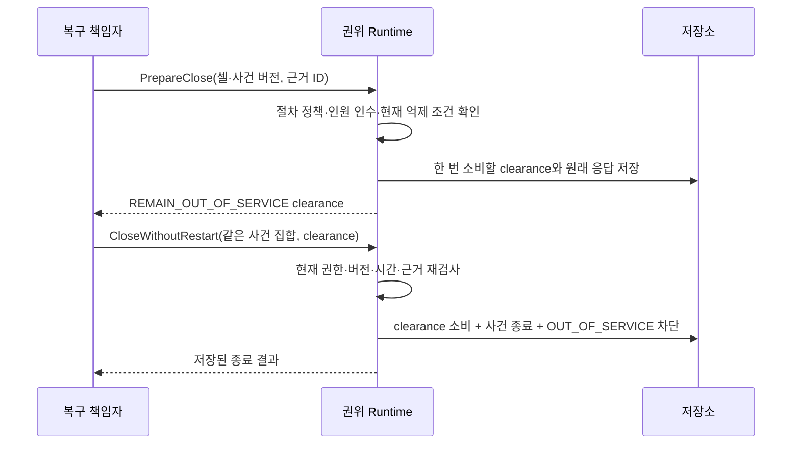

# 비운전 사건 종료

2026-09-11. `PrepareClose`와 `CloseWithoutRestart`의 application 경로 및 개발 HTTP를 구현했다. 사건 종료 뒤에도 `OUT_OF_SERVICE` latched block을 남긴다. 생산 재시작, 장비 정지 완료, 격리 조작의 성공을 이 종료로 판정하지 않는다.

규범 근거는 [셀 개입·복구 §7](../../spec/cell_operations/v1.0/03_intervention_recovery_change.md)와 [프로토콜](../../spec/cell_operations/v1.0/04_protocol_integration_ui.md)의 비운전 종료다. 규범 파일·wire manifest를 변경하지 않았다. 아래 정책 형식은 구현 내부의 검증 입력이며 새로운 규범 wire 계약으로 승격하지 않는다.

## 흐름과 책임

Close는 영향 셀의 epoch를 올리고 기존 권한을 철회하는 공통 invalidation을 사용한다. 새로운 Fence 전달은 등록하지만 ArmCell·native reset·이동·취소 명령을 만들지 않는다. 이 새로운 Fence 응답까지 받았다는 뜻도 아니다. 종료 전에 확인한 현재 Fence와 별도로, 남아 있는 물리 위험의 억제·격리 근거는 외부 절차와 실제 관측이 제공해야 한다.

## 입력 정책

`closure::Policy` (`rx.close-policy.v1`)는 다음을 고정한다.

| 항목 | 의미 |
|---|---|
| cell, procedure | 원 사건 셀과 정확한 Procedure Policy artifact |
| external_procedure, dependencies | 운전 제외 상태를 유지할 외부 절차 및 검증 근거 |
| contexts | 영향받는 각 셀의 definition/envelope와 억제·격리·잔여 제한 조건 |
| maximum_validity_ns | 준비 clearance의 최대 수명 |

Engineer가 입력해도 `QualificationAuthority::verify_close_policy`가 승인하지 않으면 등록하지 않는다. 기본 구현은 항상 거부한다. 등록할 때와 준비·소비할 때 현재 verifier와 구성 binding을 검사한다. Procedure Policy의 verifier도 다시 확인한다. API에 사용자가 채우는 승인 boolean은 없다.

정책은 기존 procedure digest에 하나만 결합한다. 다른 내용을 같은 digest에 덮어쓰지 못한다. 새 종료 정책을 도입할 때는 새 절차 버전과 사건 binding이 필요하다. 그 변경·재연결 워크플로는 후속 구현이다. 실제 release/package verifier, 서명 신뢰 설정, 현장 외부 절차 승인 완료를 뜻하지 않는다.

## 준비 조건

- 현재 인증된 RecoveryLead가 모든 대상 사건의 lead이며 전체 영향 셀에 접근할 수 있어야 한다. 준비자와 소비자는 현재 같은 lead다. 담당자 인계는 이 API로 생략하지 않는다.
- 셀 CAS와 사건별 CAS가 필수다. 비어 있거나 중복된 사건 집합을 거부한다. 현재 지원하는 cohort는 같은 원 셀의 사건들이다. 그 셀의 공유 자원으로 연결된 영향 셀 전체를 검사한다.
- 각 사건은 REVALIDATING이고 기록된 참여자가 있어야 한다. 전원 작업 종료, 현재 인원 확인, 인수 완료가 필요하다. 빈 명단은 사람 없음으로 바꾸지 않는다.
- 승격에 성공한 PERSONNEL_ACCOUNTED/HANDOVER_ACCEPTED의 record ID를 Progress에 보존한다. 그 기록의 실제 lead·명단·Reported 상태·관측 시각·유효기간과 마지막 물리 변화 이후인지 확인한다.
- 현재 각 Host의 해당 epoch/boot/journal Fence 확인과 정책의 조건 PASS가 필요하다. 조건은 기존 P의 source generation, quality, age, uncertainty, schema/unit 평가를 사용한다.
- 조건 근거는 취득 불확실성을 뺀 가장 이른 취득 시각도 마지막 물리 변화 이후여야 한다. 호출자가 제시하는 근거 ID 집합은 실제 인원/인수 record ID와 평가에 사용한 관측 ID의 집합에 정확히 일치해야 한다. 임의 ID 추가·누락·중복을 거부한다.
- 유효시간은 정책 TTL, 현재 인증 세션, 절차 보고 최대 age/유효기간, 실제 조건 근거의 만료 중 가장 이른 시각이다. 새 보고나 새 근거가 있다고 기존 clearance 수명을 늘리지 않는다.

clearance는 case revisions, 전체 영향 셀 revision/definition/envelope/epoch, policy refs, 정확한 evidence IDs, 준비자·시각·유효시간에 결합된다. 준비만으로 사건 상태나 허가를 확대하지 않는다. run/restart plan을 요구하지 않는다.

## 소비 트랜잭션

1. 현재 역할과 사건·영향 셀 접근권을 확인한 뒤 idempotency key를 조회한다.
2. 셀/사건 CAS, 같은 cohort·준비자, 미소비 clearance와 만료를 검사한다.
3. 정책·절차·참여자·Fence·조건을 다시 평가한다. 준비 때와 셀 context, policy ref, evidence ID가 다르면 소비하지 않는다.
4. 전체 영향 셀을 invalidation하고 별도 OUT_OF_SERVICE 차단을 만든다.
5. 대상 사건이 만들었던 차단만 제거한다. 다른 열린 사건이 참조하는 차단은 유지한다. 기존 OUT_OF_SERVICE나 다른 원인의 차단도 제거하지 않는다.
6. 대상 사건만 CLOSED로 바꾸고 open_case membership에서 제거한다.
7. clearance 소비, 종료 영수증, 상태·제어 원장 사건, 원래 요청 응답을 같은 저장 트랜잭션에 기록한다.

저장 전 장애는 전체 rollback이다. 저장 후 응답 유실은 동일 key/body로 원래 결과를 회수한다. 다른 body를 같은 key로 보내면 충돌이다. 준비 요청을 재전송하면 원래 준비 결과가 반환된다. 이미 소비된 clearance가 다시 사용 가능해졌다는 뜻은 아니며 새 소비는 현재 저장 상태를 검사한다.

사건 CLOSED는 원 operation의 UNKNOWN/UNRESOLVED를 성공·취소로 바꾸지 않는다. 자원 quarantine/holder도 해제하지 않는다. 이를 유지한 상태의 비운전 종료에는 별도로 검증된 외부 억제 조건이 필요하다. 논리 block을 물리 격리 장치로 표시하지 않는다.

## 늦은 보고와 저장 호환

외부 물리 변화 보고는 이전 인원 확인·인수 ID 및 확인 상태를 무효화한다. 이전 entry 역시 해당 전이 규칙에 따라 다시 확인해야 한다.

이미 저장된 같은 ProcedureRecord가 다른 요청 key로 다시 도착하면 사실을 중복 기록하거나 과거 WorkStarted 전이를 재실행하지 않는다. 현재 사건과 기존 record를 반환하고 단계 승격은 STALE_REVISION으로 거부한다. 같은 요청 key의 재전송은 기존 영수증을 그대로 반환한다.

CLOSED 사건의 새 비물리 보고는 기록만 남기고 재검증 상태로 자동 승격하지 않는다. 새 물리 변화 보고는 사실·차단·open_case membership을 다시 기록한다. 새 작업 시작이면 ESCALATED로 남겨 실제 활동을 누락하지 않는다. 이전 종료 영수증과 OUT_OF_SERVICE 차단은 역사와 현재 제한으로 보존된다.

Progress의 새 인원/인수 record ID는 optional/default-none으로 읽는다. 이전 저장 데이터에서 단순 true 값을 보고 성공한 record ID를 추정하지 않는다. 종료하려면 해당 기록을 새로 확인해야 한다.

## 연결 상태와 한계

| 경계 | 현재 상태 |
|---|---|
| application / 단일 Runtime writer | 준비·소비·권한·원자성 연결 |
| 개발 HTTP | POST `/api/v1/cases/close-preparations`, `/api/v1/cases/close-without-restart` |
| 요청 형식 | 기존 `{request_key, command}`; `closure::PrepareClose` / `CloseWithoutRestart` |
| 개발 HTTP 결과 | Clearance 또는 전체 영향 셀을 포함한 종료 Receipt |
| UI 상태 표시 | OUT_OF_SERVICE를 ‘운전 제외 · 별도 재검증 필요’로 표시 |
| 전용 종료 화면 / 일반 operator service peer | 미구현 |
| frozen gRPC PrepareClose/CloseWithoutRestart | 아직 활성화하지 않음. CellContext projection은 연결됨. 인간 세션·등록 단말과 서비스 호출의 binding을 연결한 뒤 활성화할 예정 |
| 무진입 진단 종료 / 빈 참여자 절차 | 미구현; 명시적인 무진입 근거가 없으면 거부 |
| scope 불명 / configuration_changed 사건 | 현재 거부; 실제 영향 확정 및 새 구성 qualification 연결 필요 |
| RestartRun / recovery plan / native cancel | 이 경로와 별도, 후속 |
| 제품 이미지 / 현장 commissioning | 이 기능 시험으로 완료 표시하지 않음 |

모든 정상 경로 시험은 simulation authority와 합성 조건을 사용했다. 레이저 장비의 실제 격리/인원 확인/신호 목록은 여전히 미확정이며 실장비를 제어하지 않았다.

## 검증 범위

`transactions.rs`의 non_operating_close 및 closed_case 시험은 준비/소비 rollback·응답 유실·동일 key·한 번 소비, 다른 사건 차단 유지, 만료, 사건/epoch/관측/source/공유 범위 변화, 역할 철회, 누락/임의 근거, 새 작업, UNKNOWN와 자원 보존, 종료 후 보고를 확인한다. 개발 HTTP 시험은 권한·필수 CAS·미확인 절차·가짜 clearance 거부와 셀 무변경을 확인한다. 성공적인 종료 HTTP 브라우저 플로와 다중 원 셀 cohort 시험은 수행하지 않았다.
