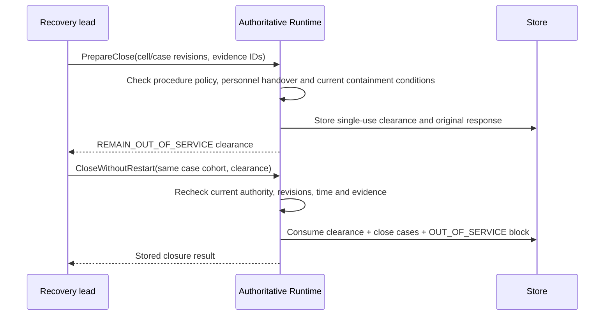

# Non-operating case closure

2026-09-11. Application paths and development HTTP for `PrepareClose` and `CloseWithoutRestart` are implemented. An `OUT_OF_SERVICE` latched block remains after case closure. Closure does not establish production restart, device stop completion or successful isolation actions.

Normative sources are non-operating closure in [cell intervention/recovery §7](../../spec/cell_operations/v1.0/03_intervention_recovery_change.md) and the [protocol](../../spec/cell_operations/v1.0/04_protocol_integration_ui.md). Normative files/wire manifests are unchanged. The policy format below is an internal implementation validation input, not a new normative wire contract.

## Flow and responsibilities

Close uses shared invalidation that increments impacted cell epochs and revokes existing authority. It registers new Fence delivery but creates no ArmCell/native reset/motion/cancel commands. It does not mean that these new Fence responses have been received either. Separately from the current Fence checked before closure, external procedures and actual observations must supply evidence for containment/isolation of remaining physical hazards.

## Input policy

`closure::Policy` (`rx.close-policy.v1`) fixes:

| Item | Meaning |
|---|---|
| cell, procedure | Origin case cell and exact Procedure Policy artifact |
| external_procedure, dependencies | External procedure and verification evidence for remaining out of service |
| contexts | Definition/envelope and containment/isolation/residual-restriction conditions for each impacted cell |
| maximum_validity_ns | Maximum lifetime of prepared clearance |

Even Engineer input is not registered unless approved by `QualificationAuthority::verify_close_policy`. The default implementation always rejects it. Current verifier and configuration binding are checked at registration, preparation and consumption. The Procedure Policy verifier is rechecked too. The API has no user-supplied approval boolean.

Only one policy binds to an existing procedure digest. Different content cannot overwrite the same digest. A new closure policy requires a new procedure version and case binding. The change/rebinding workflow is follow-up implementation. This does not establish completion of an actual release/package verifier, signing trust configuration or field external-procedure approval.

## Preparation conditions

- The currently authenticated RecoveryLead must lead every target case and have access to all impacted cells. Preparer and consumer are currently the same lead. This API does not bypass lead handover.
- Cell CAS and per-case CAS are required. Empty or duplicate case cohorts are rejected. Currently supported cohorts contain cases from the same origin cell. Every impacted cell connected through that cell's shared resources is checked.
- Each case must be REVALIDATING and have recorded participants. All participants must have ended work, current personnel accounting and handover must be complete. An empty roster is not interpreted as no people present.
- Progress preserves the record IDs of PERSONNEL_ACCOUNTED/HANDOVER_ACCEPTED reports that successfully advanced state. Check those records' actual lead/roster/Reported status/observation time/validity and whether they follow the latest physical change.
- Each current Host must have confirmed the Fence for its relevant epoch/boot/journal, and policy conditions must PASS. Conditions use P's existing source generation, quality, age, uncertainty and schema/unit evaluation.
- Even the earliest acquisition time after subtracting acquisition uncertainty must follow the latest physical change. Caller-supplied evidence IDs must exactly match the union of actual personnel/handover record IDs and observation IDs used for evaluation. Arbitrary additions, omissions and duplicates are rejected.
- Validity ends at the earliest of policy TTL, current authentication session, procedure report maximum age/validity and actual condition-evidence expiry. A new report or evidence does not extend existing clearance lifetime.

Clearance binds case revisions, every impacted cell's revision/definition/envelope/epoch, policy refs, exact evidence IDs, preparer/time/validity. Preparation alone does not expand case state or permissions. It does not require a run/restart plan.

## Consumption transaction

1. Check current role and case/impacted-cell access before looking up the idempotency key.
2. Check cell/case CAS, the same cohort/preparer, unconsumed clearance and expiry.
3. Reevaluate policy/procedure/participants/Fence/conditions. Do not consume if cell context, policy refs or evidence IDs differ from preparation.
4. Invalidate all impacted cells and create a separate OUT_OF_SERVICE block.
5. Remove only blocks created by the target cases. Preserve blocks referenced by other open cases. Existing OUT_OF_SERVICE blocks or blocks from other causes are not removed either.
6. Change only target cases to CLOSED and remove them from open_case membership.
7. Record clearance consumption, closure receipt, state/control-journal events and original request response in the same storage transaction.

A pre-persistence failure rolls back everything. A lost post-persistence response is recovered with the same key/body. A different body with the same key conflicts. Replaying a preparation request returns the original preparation result. This does not make a consumed clearance usable again; new consumption checks current stored state.

Case CLOSED does not convert the original operation's UNKNOWN/UNRESOLVED into success/cancellation. It does not release resource quarantine/holders either. Non-operating closure preserving these states requires separately verified external containment conditions. Logical blocks are not presented as physical isolation devices.

## Late reports and storage compatibility

External physical-change reports invalidate previous personnel/handover IDs and confirmation state. Previous entry also requires reconfirmation under the relevant transition rules.

If the same already-stored ProcedureRecord arrives with another request key, it does not duplicate the fact or replay a historical WorkStarted transition. It returns the current case and existing record, rejecting stage advancement with STALE_REVISION. Replay with the same request key returns the existing receipt unchanged.

A new nonphysical report for a CLOSED case is recorded without automatically advancing to revalidation. A new physical-change report records the fact, blocks and open_case membership again. New work starts leave the case ESCALATED so actual activity is not omitted. Previous closure receipts and OUT_OF_SERVICE blocks are preserved as history and current restrictions.

The new personnel/handover record IDs in Progress are read as optional/default-none. Successful record IDs are not inferred from simple true values in earlier stored data. Closure requires fresh verification of those records.

## Connection status and limitations

| Boundary | Current status |
|---|---|
| Application / single Runtime writer | Preparation/consumption/authority/atomicity connected |
| Development HTTP | POST `/api/v1/cases/close-preparations`, `/api/v1/cases/close-without-restart` |
| Request format | Existing `{request_key, command}`; `closure::PrepareClose` / `CloseWithoutRestart` |
| Development HTTP result | Clearance or closure Receipt including all impacted cells |
| UI status display | OUT_OF_SERVICE shown as 'Out of service · separate revalidation required' |
| Dedicated closure UI / general operator service peer | Not implemented |
| Frozen gRPC PrepareClose/CloseWithoutRestart | Not enabled yet. CellContext projection is connected. Planned after binding human sessions/registered terminals to service calls |
| No-entry diagnostic closure / empty-participant procedure | Not implemented; rejected without explicit no-entry evidence |
| Scope-uncertain / configuration_changed cases | Currently rejected; actual impact determination and new-configuration qualification must be connected |
| RestartRun / recovery plan / native cancel | Separate from this path; follow-up work |
| Product images / field commissioning | Not marked complete by these feature tests |

All successful-path tests used a simulation authority and synthetic conditions. Actual laser-equipment isolation/personnel accounting/signal lists remain undefined, and no real equipment was controlled.

## Validation scope

The non_operating_close and closed_case tests in `transactions.rs` verify preparation/consumption rollback, lost responses, same keys, single consumption, preservation of other cases' blocks, expiry, case/epoch/observation/source/shared-scope changes, role revocation, missing/arbitrary evidence, new work, preservation of UNKNOWN/resources and post-closure reports. Development HTTP tests verify authority, required CAS, rejection of unverified procedures/fake clearances and unchanged cells. A successful closure HTTP browser flow and multi-origin-cell cohort tests were not performed.
