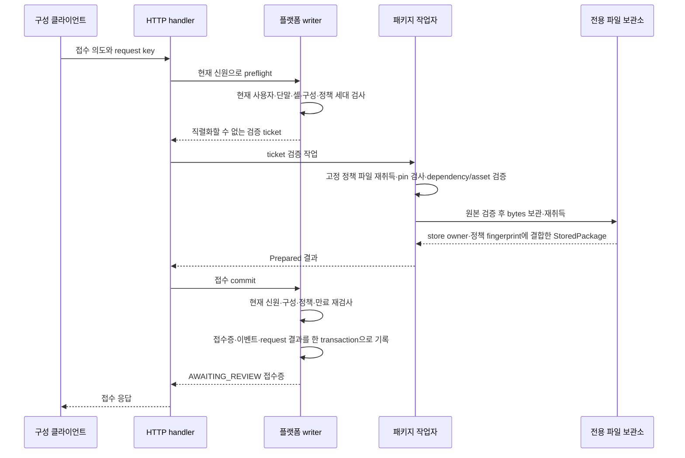

# 사용자·셀별 패키지 반입 접수

2026-09-12. `package_intake`는 검증·보관한 패키지를 현재 사용자와 셀 문맥에 결합해 원장에 접수한다. 결과는 `AWAITING_REVIEW`다. 접수증은 내용·제출자·대상 셀을 식별하는 기록이며, 독립 검토 승인이나 운전 활성화가 아니다.

선행 기반은 [패키지 저장소](../rx-package/STORE.md)다. application은 파일을 읽거나 서명을 검증하며 writer를 기다리게 하지 않는다. Runtime의 별도 작업자가 이를 수행하고, application은 그 결과의 실제 소유권과 현재 권한·문맥을 검사한다.

## 처리 순서



HTTP handler가 writer와 작업자의 호출을 조정한다. ticket/Prepared/StoredPackage는 내부 Rust 값이며 HTTP 응답으로 내보내지 않는다. HTTP가 worker를 호출하는 동안 writer는 다른 명령을 처리할 수 있다.

1. 클라이언트는 현재 반입 문맥을 조회한다. 구성 fingerprint는 CellConfiguration 전체, 정책 세대는 현재 Runtime에 구성된 패키지 서비스의 registration에 결합한다.
2. POST에는 접수 ID·셀·제목·반입 폴더 아래 상대 경로·예상 object ID·앞에서 본 구성 digest와 정책 세대를 넣는다. object ID의 manifest/signature 두 hash를 모두 고정한다. 폴더의 내용이 교체되어 다른 signed package가 되어도 같은 요청으로 받지 않는다.
3. writer는 현재 session/사용자/단말 범위와 Engineer 역할을 확인한다. 동일 request key/body가 이미 commit되어 있다면 기존 접수증을 회수한다. 이 경로는 **과거 접수 결과 조회**이며 새 검증이나 승인으로 표시하지 않는다. 같은 key의 다른 body는 충돌이다.
4. 신규 요청은 현재 서비스 등록과 구성 digest가 일치해야 한다. 같은 접수 ID가 이미 있으면 거부한다. 30초 유효기간의 ticket을 발급한다. ticket은 입력·요청 key·실제 Identity·Runtime boot·서비스 registration·발급/만료 시각을 보유하며 Deserialize를 구현하지 않는다. 이 ticket은 아직 영속 접수 기록이 아니다.
5. 작업자는 한 번에 한 취득만 허용한다. 실행 중인 취득이 있으면 추가 대기를 무한히 쌓지 않고 거부한다. 다른 업무 명령의 writer queue를 점유하지 않는다. 작업 취소가 이미 진행 중인 filesystem I/O를 즉시 취소한다고 보장하지 않는다.
6. 실제 daemon의 작업자는 매 신규 요청마다 고정된 정책 파일을 다시 읽고 정확한 bytes hash를 검사한다. dependency/asset 입력도 policy loader에서 다시 확인한다. 원본 패키지를 검증하고 요청한 두 hash와 비교한 다음 Store에 보관한다. 저장소에서 다시 검증·취득한 bytes만 Prepared에 포함한다.
7. commit 시 현재 신원/역할/단말, Runtime boot, 서비스 registration, CellConfiguration digest와 ticket 시간을 다시 검사한다. 권한·단말·정책 세대가 바뀌거나 만료되면 신규 접수 기록을 만들지 않는다. 파일은 미참조 object로 남을 수 있다.
8. 접수증·`rx.event.package-intake-submitted.v1`·idempotency 결과를 같은 SQLite transaction에 기록한다. 상태는 항상 AWAITING_REVIEW이며 Cell/Run/qualification/permit/Host outbox를 바꾸지 않는다.

## 파일 보관과 DB commit의 경계

filesystem과 SQLite를 하나의 transaction이라고 부르지 않는다. 순서는 **완성된 object 공개 → writer 접수 commit**이다.

| 중단/실패 지점 | 남을 수 있는 것 | 다시 요청했을 때 |
|---|---|---|
| 최초 권한·문맥 검사 전후 | 접수증 없음 | 현재 조건부터 재검사 |
| 원본 검증 실패 | 접수증 없음 | 입력·정책 확인 후 같은 의도로 재시도 가능 |
| 파일 기록 도중 | 미완성 `.incoming-*` | 자동 접수/자동 재생 없음. 기존 Store 규칙 적용 |
| 완성된 object 후, DB commit 전 | 참조되지 않은 object | 전 bytes 비교와 재검증 후 신규 접수 가능 |
| DB transaction rollback | 접수증·이벤트·request 결과 모두 없음 | 동일 key로 다시 접수 가능 |
| DB commit 후 응답 유실 | 세 기록이 모두 존재 | 현재 신원/범위 확인 후 원래 접수증 회수 |
| commit 뒤 원본 파일 변경/삭제 | 원래 접수증과 저장 object | 같은 요청은 원래 결과를 조회. 새로운 요청은 원본을 새로 검증 |

역사 조회 시 내용이 지금도 유효하다고 단정하지 않는다. 과거 접수증을 회수할 수 없는 것과 신규 사용을 승인할 수 없는 것은 다른 문제다.

## 실제 검증 결과와 현재 정책

`StoredPackage`의 필드는 private이며 Store만 생성한다. 내부 값은 다음을 묶는다.

- 실제로 bytes를 읽은 Store 인스턴스의 owner ID.
- 실제 검증에 사용한 VerificationPolicy의 의미 fingerprint.
- manifest/signature object ID.
- immutable VerifiedPackage bytes와 manifest.

등록된 것과 다른 Store에서 얻은 동일 내용도 해당 ticket의 결과로 사용할 수 없다. 다른 정책으로 검증한 결과에 올바른 policy ID 문자열만 붙여 통과시키는 것도 허용하지 않는다. application의 Prepared 생성과 최종 commit 양쪽에서 확인한다. Store나 policy 구성 자체는 신뢰된 Runtime 조립 경계다. 브라우저가 공개키·policy fingerprint·성공 Boolean을 제출해 서비스 등록을 바꾸는 API는 없다.

정책 의미 fingerprint는 publisher/key/허용 종류·permission, 두 계약 hash/ABI/target, 검증된 dependency manifest·signature, asset 참조와 취득 한도를 포함한다. 정수 한도는 기존 Counter 문자열 표현으로 정규화하여 큰 u64 값이 반올림되어 같은 fingerprint가 되지 않게 한다. 정책 파일 digest와 구별한다. 파일 digest는 입력 bytes의 pin이고, 의미 fingerprint는 실제 검증 정책의 pin이다.

`configure_package_intake`는 내부 조립 명령이다. 구성/교체/비활성화는 원장에 남기며 새 세대 ID를 사용한다. 이전 boot의 등록은 재시작 후 자동 활성화하지 않는다. 새 daemon은 현재 파일을 검증한 뒤 새 Store owner와 등록 세대를 만든다. 이전 접수 이력은 유지하지만 현재 검토 문맥으로 자동 승격하지 않는다.

정책 파일의 hot-edit는 정상 신뢰 변경 절차가 아니다. production trust revision의 배포·회수는 후속 관리 기능이며 현재는 기동 설정의 pin과 명시적 내부 등록/비활성화를 사용한다. 실제 worker는 매 신규 취득에 파일 pin을 검사한다. 이미 취득한 policy snapshot 이후의 외부 파일 변조를 writer가 동기 filesystem 조회로 감시하지는 않는다. 정상 정책 변경은 등록 세대를 교체/폐기해야 대기 중 commit도 거부된다.

## HTTP 계약

현재는 browser BFF의 확장이다. frozen base/cell Protobuf나 규범8개를 수정하지 않았다.

| API | 권한 | 결과 |
|---|---|---|
| GET `/api/v1/package-intake-context?cell=...` | 해당 셀 Engineer 또는 Verifier | 구성 digest, 등록된 정책 세대 또는 null |
| POST `/api/v1/package-intakes` | 해당 셀 Engineer | 새 접수 또는 같은 요청의 과거 Receipt |
| GET `/api/v1/package-intakes?cell=...&after=...` | 해당 셀 Engineer 또는 Verifier | ID 순서 최대50개와 next cursor |
| GET `/api/v1/package-intake?cell=...&id=...` | 해당 셀 Engineer 또는 Verifier | 현재 문맥과 비교한 View |

mutation body는 기존 `{request_key, command}`를 따른다. Submit 필드는 `id`, `cell`, `title`(1–120자), `relative_path`, `object`, `configuration_digest`, `policy_generation`이다. 알 수 없는 필드·경로 이탈·역슬래시/절대 경로 등은 기존 strict JSON/PackagePath 규칙으로 거부한다. `approved=true` 같은 필드를 추가해 의미를 바꿀 수 없다.

Receipt는 제출자와 실제 terminal ID, 제출 시각, object/manifest/대상 셀·구성/registration을 보존한다. GET View에는 다음을 명시한다.

- `review_context_current`: 등록된 서비스 세대와 셀 구성이 접수 당시와 같은가. **파일·자격의 현재 검증 결과가 아니다.**
- `content_reverification_required=true`: 검토·사용 시 새 내용 검증이 필요하다.
- `activation_authorized=false`: 접수·조회는 운전 허가가 아니다.

현재 권한은 cache 결과 반환 전에도 확인한다. 다른 셀로 같은 ID를 조회해 접수증을 얻을 수 없다. 제어기/Host 역할만 가진 사용자는 Engineer 권한을 대신하지 못한다. 서비스가 미구성되어도 이력 조회는 가능하며 신규 접수는 불가하다.

현재 worker의 입력/검증/취득 오류와 busy는 `PACKAGE_VERIFICATION_FAILED` 409로 축약한다. 실제 원인을 분류해 운영 지원 화면에 연결하는 것은 후속이다. writer commit의 응답 유실은 기존 `outcome_unknown` 규칙을 유지한다. 이때 다른 request key로 즉시 대체하지 말고 기존 key/body의 결과를 회수한다.

## 플랫폼 실행 설정

`rx.platform-startup.v1`에 선택 필드 `package_intake`를 추가했다. 생략하면 worker를 구성하지 않는다.

```text
package_intake:
  import_root: /mnt/rx-import
  policy:
    path: /etc/rx/package-policy.json
    sha256: <정확한 파일 bytes SHA-256>
```

이는 필드 설명이며 유효한 JSON 예제가 아니다. policy는 기존 `rx.package-verification-policy.v1` 형식이다. 실동작 설정에는 절대 경로와 실제 hash가 필요하다. dependency/asset 경로도 절대 경로다. import root는 실제 디렉터리여야 하며 authority data directory와 겹치지 않는다. read-only 반입 mount와 별도의 관리자 설정 mount를 사용한다. 패키지 보관소는 `<data_directory>/packages`로 고정한다.

작업자는 정책 pin·형식·의존 입력을 검증하고 저장소 독점 소유권을 얻어야 기동된다. 잘못된 정책 pin은 서비스 기동을 거부한다. 기본 qualification authority는 여전히 미연결이며 이 옵션을 켜도 로봇/PLC/native 프로세스를 시작하지 않는다. P가 이 저장소를 소유하는 동안 오프라인 `rx-package-store`가 같은 root를 동시에 열 수 없다.

구성된 서비스의 정책은 서명 검증 범위를 정할 뿐 어떤 셀의 실제 장비 상태·공정 품질을 증명하지 않는다. test-only 정책과 모의 근거를 production trust로 자동 등록하지 않는다.

## 검토 승인으로 이어가기 위한 미완료 조건

반입 다음의 공정 검토·소프트웨어 승인 API는 [PROCESS_REVIEW.md](PROCESS_REVIEW.md)에 연결했다. 접수증 ID만으로 승인하지 않고, 실제 S 검증 자료와 P의 독립 대조 결과를 특정 검토 revision/digest에 고정한다. 검토 화면, Device/UI·절차 검증과 활성화는 남아 있다. 아래는 전체 연결 조건이며 일부가 구현된 상태다.

1. 같은 object의 새 내용 검증과 현재 정책·구성·dependency/asset 문맥을 독립 검토 결과에 결합한다.
2. Process는 S `compile_verified`의 실제 결과·compiler identity·resolved digest와 Cell StepBinding/현장 context의 일치를 확인한다. Device/UI는 각 종류의 의미 검증기가 필요하다.
3. 검토자가 보는 manifest·원문·바인딩·변경 영향과 시험 결과를 불변 review revision으로 고정한다. 미수행·만료·실패는 PASS로 압축하지 않는다.
4. 현재 Verifier 역할과 명시적 검토 대상 revision, 작성/검토 역할 분리 정책을 검사한다. 승인과 활성화를 별도 transition으로 기록한다.
5. 활성화는 운전 중 immutable 참조, 변경 영향 closure, 정리/복구·qualification·현재 조건 및 기존 base/cell 허가 규칙을 적용한다.

현재 시험에는 DB commit 전 실패/commit 후 응답 유실, 동시 ID 충돌, 역할/단말 회수, 정책 비활성화·교체, ticket 만료, 다른 Store/정책 proof 거부, 이력 재조회·재시작과 실제 단말 mTLS 기동 경로가 포함된다. 대용량 지속 취득·디스크 장애·배포 중 trust hot-update와 현장 인수는 검증하지 않았다.
