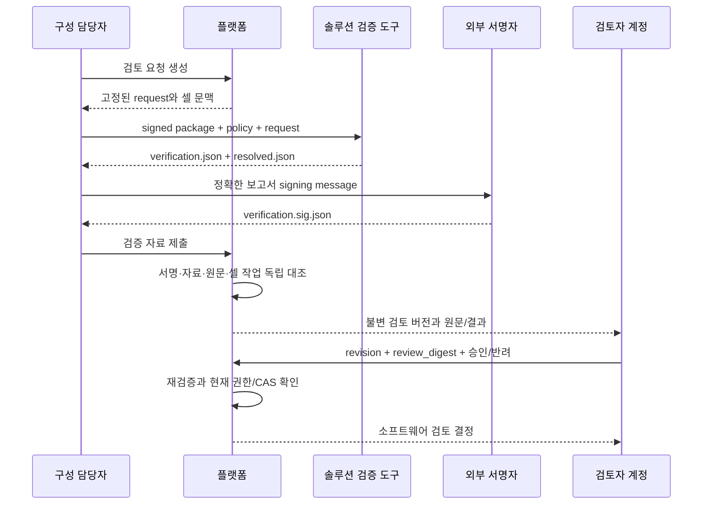

# 공정 패키지의 검증 자료·검토 버전·소프트웨어 승인

2026-09-12. [반입 접수](PACKAGE_INTAKE.md) 다음 경로다. 대상은 공정 패키지이며 승인 범위는 `PROCESS_PACKAGE_SOFTWARE`다. 검토한 원문·컴파일 결과·현재 셀의 작업 연결을 고정하고, 제출자와 다른 Verifier 계정이 그 검토 버전을 승인하거나 반려한다. 승인으로 Run, qualification, Host grant 또는 작업 permit을 만들지 않는다.

## 실제 처리 경로

1. P가 반입된 패키지에 대해 검토 요청을 만든다. 패키지 manifest/signature 두 hash, 전체 CellConfiguration digest, 패키지 검증 정책과 검증자 권한의 fingerprint, 작업 alias→정확한 Cell StepBinding 선택을 요청에 고정한다. 당시 CellConfiguration도 함께 보존한다.
2. S의 `rx-process-package review`가 실제 서명된 패키지를 현재 정책으로 읽고 `compile_verified`를 실행한다. 패키지 조립의 일치 여부와 공정 컴파일을 확인하며, 성공이면 canonical `resolved.json`, 실패면 구체 issue가 있는 `verification.json`을 낸다.
3. 검증 자료는 독립 서명자에게 전달한다. S는 `review-signing-request`로 서명 대상의 정확한 bytes를 내보낸다. 개인키 생성/보관이나 production 서명 서비스는 이 도구에 없다.
4. P의 작업자가 원래 패키지 Store를 다시 읽고, 현재 패키지 정책과 별도 검증자 권한 파일을 확인한다. 보고서의 서명자/key, 허용된 검증기 digest, 요청·패키지 동일성, resolved 파일의 hash/size를 검사한다.
5. P는 S 컴파일러를 호출하거나 S crate를 의존하지 않고 원문과 제공된 결과를 독립적으로 대조한다. 결과를 새 검토 버전으로 원장에 기록한다. 서명이 맞더라도 P 검사에 실패하면 승인 준비 상태가 되지 않는다.
6. Verifier가 정확한 검토 revision과 `review_digest`를 지정해 승인한다. 승인 직전에도 worker가 Store·정책·서명·자료를 다시 검사하고, writer가 현재 계정·구성·정책·검토 revision을 최종 확인한다.



이 경로는 오프라인 artifact 교환으로 두 이미지의 책임을 연결한다. P가 S의 실행 파일을 자기 이미지에 복사하거나 Docker 관리 권한을 사용하지 않는다. 공통 base/cell gRPC 계약은 기존 실행 통신에 유지하며, 이번 artifact 계약은 별도의 JSON 자료다.

## 신뢰와 검사 범위

보고서에는 caller-supplied PASS가 없다. `resolved` 참조와 issues, 검증기 identity, 검토 request가 들어간다. P는 S의 issues가 없고, 실제 resolved/source가 존재하며 독립 검사도 통과한 경우만 승인 준비 상태로 계산한다.

서명은 다음 domain에 key ID와 canonical report bytes를 결합한다.

```text
RX-PROCESS-VERIFICATION-REPORT-v1\0 + canonical(key ID) + \0 + canonical(report)
```

패키지 manifest 서명과 서로 다른 domain이다. key ID만 바꿔 같은 공개키의 다른 등록을 이용하거나, 다른 검토 요청의 보고서를 가져와 사용할 수 없다. P의 별도 `rx.process-verification-authority.v1` 파일은 key ID/public key와 그 key가 주장할 수 있는 validator digest 집합을 지정한다. 이 파일도 정확한 bytes hash로 고정한다.

S validator digest는 검증 코드·컴파일러 관련 코드·shared contract·SDK source lock·Cargo lock을 포함한 source identity다. **서명은 허용된 생산자의 주장이고, 실행 중인 바이너리에 대한 하드웨어 원격 증명은 아니다.** 실제 production 서명자는 사용자가 임의 작성한 PASS 자료를 무조건 서명하는 형태로 구현해서는 안 된다. 현재 통합 시험의 서명자는 명시적인 test-only 고정 키이며 production trust에 자동 등록하지 않는다.

P는 다음을 직접 검사한다.

- 실제 Store owner가 제공한 immutable bytes, 현재 패키지 policy fingerprint, 검토 request·패키지 두 hash와 현재 verifier authority의 일치.
- 보고서의 서명·validator 허용 범위와 resolved artifact의 정확한 SHA-256/size/canonical bytes.
- 공정 source 구조, source/input/bindings 파일의 일치, package entry, normalized source digest·process ID·조건 정의.
- 제공된 compiled tree의 node ID·구조·자원 충돌과 **원문과의 연결**. 새 트리를 만들어 비교하지 않고 제공된 트리를 순회하면서 순서/병렬 종류·child 순서·분기 방향·반복 횟수·call instantiation·wait 값·작업 binding·절차 참조를 확인한다.
- 패키지의 cell/binding catalog와 현재 CellConfiguration, 사용한 모든 binding의 host/normalized intent 및 정확히 선택한 StepBinding.
- 각 operation의 선언 권한, 사용된 조건의 현재 FactSpec/schema/unit, 모든 분기에서 보장되는 StepBinding predecessor 순서. 병렬 분기의 predecessor는 다른 분기가 아직 완료됐다고 가정하지 않는다.

현재 intervention node는 artifact 참조의 원문/결과 일치까지만 확인한다. 실제 P 절차 policy 승인과 연결한 검증이 남아 있어 **이 노드를 포함한 공정은 소프트웨어 승인 준비로 통과시키지 않는다.** Device/UI 패키지의 독립 의미 검증도 후속이다. 로봇 경로·교정·실장비 신호·가공 품질 검증은 이 소프트웨어 검사로 증명되지 않는다.

## 저장과 결정의 동일성

`Job`은 요청과 당시 구성 snapshot을 보존한다. 현재 package policy/검증자 authority가 같은 의미와 pin으로 다시 구성됐다면 재시작 뒤에도 요청을 이어갈 수 있다. worker ticket은 현재 boot/Store owner에만 유효하며 30초가 지나면 commit할 수 없다.

`Version`에는 원래 signed report와 signature, report digest, P checker digest, P issues, source/resolved artifact 참조, 기록 계정/시각이 들어간다. 원문과 결과는 각각 내용 hash에 결합된 별도 불변 DB 문서로 저장한다. 현재 artifact 한도는 각각 1 MiB다. S도 더 큰 resolved 결과를 성공 자료로 출력하지 않고 크기 제한 issue를 기록한다.

`review_digest`는 report digest뿐 아니라 signature, 검토 revision, P checker digest/결과, 자료 참조와 준비 판정을 묶는다. P 검사 코드가 바뀌거나 새 보고서 버전이 생기면, 이전 화면을 본 사용자가 새 대상을 승인할 수 없다. 읽을 때도 검토 버전의 digest, 내부 request/report identity, artifact hash/size를 다시 대조한다.

- 검증 자료 저장: 현재 보고서 revision CAS, 새 버전/이력, source/resolved 자료, 감사 이벤트, request 결과를 한 transaction으로 기록한다.
- 결정 저장: 현재 검토 revision·review digest와 결정 revision CAS, 결정/이력/이벤트/request 결과를 한 transaction으로 기록한다.
- 같은 key/body는 현재 계정 권한을 먼저 확인한 뒤 원래 결과를 회수한다. 다른 body는 충돌이다. 회수된 결정은 역사적 결정이며 새로운 실행 권한이 아니다.
- 제출 계정은 자기 패키지를 승인할 수 없다. 이는 서로 다른 등록 계정이라는 규칙이며 두 계정이 실제로 서로 다른 사람임을 증명하지는 않는다.
- 반려는 현재 Verifier 권한과 정확한 검토 대상을 확인한다. 이미 사용할 수 없게 된 패키지를 반려하는 데 Store의 긍정 검증을 요구하지 않는다.
- 승인에는 source/resolved/정책/서명 재검증이 필요하다. worker가 작업하는 동안 역할·authority·구성·현재 검토 revision이 바뀌면 신규 결정을 거부한다.

GET의 `approval_matches_current_review`는 기록된 결정이 현재 검토 버전/문맥에 맞는다는 뜻이다. 조회 자체가 파일의 현재 재검증을 실행하거나 운전 허가를 발급하는 것은 아니다. `activation_authorized`는 항상 false다. 새 보고서가 올라오면 이전 결정은 이력으로 남고 새 버전에 자동 적용되지 않는다.

## API와 실행 설정

현재 browser BFF에 다음을 제공한다. 쓰기는 기존 `{request_key, command}` 형식을 따른다.

| API | 동작 |
|---|---|
| POST `/api/v1/process-reviews` | Engineer 또는 Verifier가 반입 건의 검토 요청 생성 |
| GET `/api/v1/process-reviews?cell=...&intake=...&after=...` | 허용된 반입 건의 검토 요청 목록, 최대50개와 cursor |
| GET `/api/v1/process-review?cell=...&id=...&revision=...` | 허용된 셀의 요청·현재 검토/결정·원문/결과 조회 |
| POST `/api/v1/process-review/reports` | 서명된 검증 자료 폴더를 제출하고 새 검토 버전 생성 |
| POST `/api/v1/process-review/decisions` | Verifier가 정확한 revision/digest를 승인 또는 반려 |

Create: `id`, `intake`, `cell`, `configuration_digest`, `policy_generation`, `binding_selections`.

장비 변경 후보를 검토할 때는 `device_plans`를 추가한다. v2 요청·후보 snapshot·현재 원본 재검증·영향 셀 접근권 및 적용 차단은 [장비 후보 공정 검토](DEVICE_PROCESS_REVIEW.md)를 따른다. 이 항목이 없는 기존 요청은 v1 동작을 유지한다.

Submit: `review`, `cell`, `expected`(보고서 revision 또는 null), `directory`, `report_digest`. directory는 기존 import root 아래의 제한된 상대 경로다. 고정 파일명 `verification.json`, `verification.sig.json`, 성공 시 `resolved.json`을 읽는다. symlink 구성요소·비정규 파일·크기 초과를 거부한다.

Decide: `review`, `cell`, `report_revision`, `review_digest`, `expected`(결정 revision 또는 null), `choice`(`APPROVE`/`REJECT`), 비어 있지 않은 `note`(최대1,000자).

기동 설정의 기존 `package_intake` 아래에 선택 `review_authority`를 둔다. 형식은 다른 P pinned file과 같은 `{path, sha256}`다. 생략하면 검토 authority를 활성화하지 않는다. authority 파일의 형식은 아래와 같다.

```text
schema: rx.process-verification-authority.v1
keys:
  - id: <등록할 검증자 key ID>
    public_key: <32-byte 공개키의 lowercase hex>
    validators: [<허용된 S validator source digest>]
```

이는 설명용 자리표시자이며 실행 가능한 신뢰 설정이 아니다. 실제 파일은 JSON이며 key/validator 목록은 중복 없이 제한된 크기로 검사한다. 개인키는 P에 필요하지 않다. native 권한·ROS·장치 접근도 이 worker에 필요하지 않다.

S 도구:

```text
rx-process-package validator-identity
rx-process-package review PACKAGE POLICY REVIEW_REQUEST NEW_OUTPUT_DIRECTORY
rx-process-package review-signing-request verification.json KEY_ID NEW_REQUEST_FILE
```

S의 policy 파일 경로가 P와 달라도 실제 policy 의미 fingerprint가 같아야 한다. 보고서에는 S가 읽은 policy 파일 digest를 따로 기록한다. 요청의 P policy pin을 S에서 읽은 파일이라고 주장하지 않는다.

## 검증 근거와 남은 작업

application 시험은 원자성/응답 유실, 별도 계정, 서명·artifact 변경, 셀 binding 불일치, 새 검토/CAS와 authority·역할 회수를 다룬다. S 시험은 실제 signed compilation/실패 보고서와 순서·분기·반복·call 반례를 다룬다. 별도 S 실행 파일이 만든 자료를 P HTTP로 제출하는 통합 시험과, 등록 단말 mTLS로 기동/검토/승인하는 composition 시험을 구별해 기록한다.

공정 검토 화면/요청 목록·과거 검증 revision 조회는 [운영 앱](https://github.com/jack0682/rx-solutions/blob/codex/initial-draft/apps/operator/PACKAGE_REVIEW_UI.md)에 연결했다. decision 이력 비교, production 검증 서명 서비스/HSM, Device/UI 및 intervention policy의 의미 검증, 변경 계획/영향 검토/staging/준비는 [PROCESS_CHANGE.md](PROCESS_CHANGE.md)에 연결했다. Host 구성 ack·실제 적용/qualification 연결과 실물 인수는 남아 있다. 첫 물리 셀의 NOT_COMMISSIONED 상태를 이번 승인으로 바꾸지 않는다.
