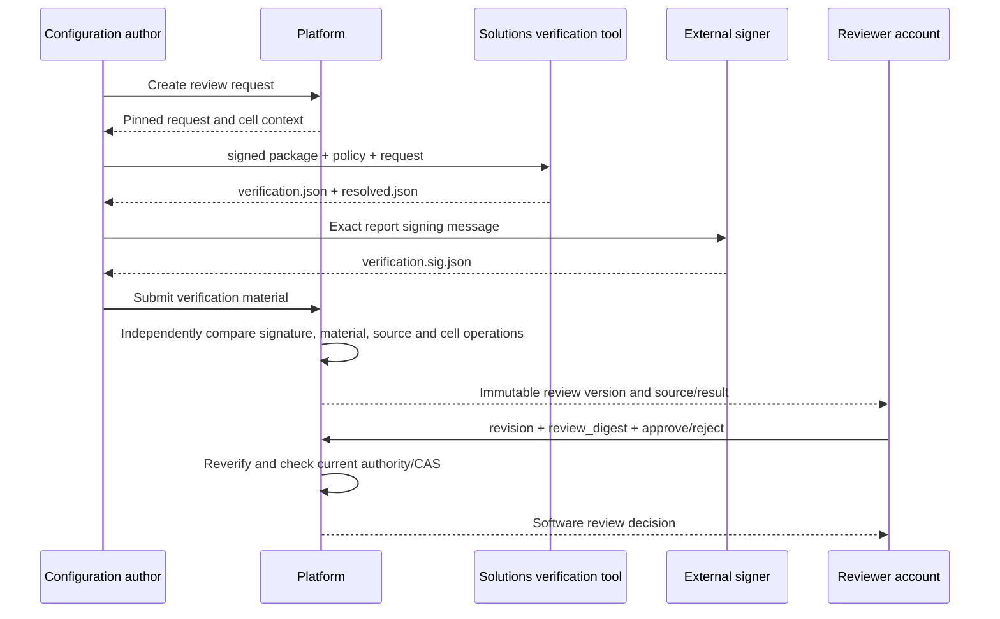

# Verification material, review versions and software approval for process packages

2026-09-12. This is the path following [package intake](PACKAGE_INTAKE.md). It targets process packages, with approval scope `PROCESS_PACKAGE_SOFTWARE`. It pins the reviewed source, compilation result and current cell operation connections, and a Verifier account different from the submitter approves or rejects that review version. Approval does not create a Run, qualification, Host grant or operation permit.

## Actual processing path

1. P creates a review request for an admitted package. The request pins both package manifest/signature hashes, the complete CellConfiguration digest, fingerprints of the package verification policy and verifier authority, and operation aliases → exact Cell StepBinding selections. The CellConfiguration at that time is preserved as well.
2. S's `rx-process-package review` reads the actual signed package under the current policy and runs `compile_verified`. It checks package assembly consistency and process compilation, producing canonical `resolved.json` on success, or `verification.json` with specific issues on failure.
3. Verification material is passed to an independent signer. S exports the exact bytes to sign with `review-signing-request`. This tool does not generate/store private keys or provide a production signing service.
4. P's worker rereads the original package Store and checks the current package policy and separate verifier authority file. It checks report signer/key, allowed verifier digest, request/package identity and resolved-file hash/size.
5. P independently compares the source and supplied result without calling the S compiler or depending on S crates. It records the result in the ledger as a new review version. Even a valid signature does not make a result ready for approval if P's checks fail.
6. The Verifier approves by specifying the exact review revision and `review_digest`. Immediately before approval, the worker rechecks Store/policy/signature/material, and the writer finally checks the current account/configuration/policy/review revision.



This path connects the responsibilities of the two images through offline artifact exchange. P does not copy S executables into its own image or use Docker administration privileges. The common base/cell gRPC contract remains in place for existing execution communication; this artifact contract is separate JSON material.

## Trust and verification scope

The report contains no caller-supplied PASS. It contains a `resolved` reference and issues, verifier identity and review request. P calculates readiness for approval only when S reports no issues, actual resolved/source material exists, and independent checks pass.

The signature binds the key ID and canonical report bytes to the following domain:

```text
RX-PROCESS-VERIFICATION-REPORT-v1\0 + canonical(key ID) + \0 + canonical(report)
```

This differs from the package manifest signature domain. Changing only the key ID cannot exploit a different registration of the same public key, and a report for another review request cannot be reused. P's separate `rx.process-verification-authority.v1` file specifies key ID/public key and the set of validator digests that key may assert. This file is also pinned by its exact bytes hash.

The S validator digest is a source identity covering verification code, compiler-related code, shared contracts, the SDK source lock and Cargo lock. **A signature is an authorized producer's assertion, not hardware remote attestation of the running binary.** An actual production signer must not unconditionally sign PASS material arbitrarily authored by a user. The signer in current integration tests is an explicitly test-only fixed key and is not automatically registered as production trust.

P directly checks:

- Immutable bytes provided by the actual Store owner, the current package policy fingerprint, and agreement among review request, both package hashes and current verifier authority.
- Report signature, validator authorization scope, and the exact SHA-256/size/canonical bytes of the resolved artifact.
- Process source structure, consistency of source/input/bindings files, package entry, normalized source digest/process ID/condition definitions.
- Node IDs, structure, resource conflicts and **connection to the source** of the supplied compiled tree. It traverses the supplied tree without building a new tree for comparison, checking sequence/parallel kinds, child order, branch direction, repeat counts, call instantiation, wait values, operation bindings and procedure references.
- The package's cell/binding catalog and current CellConfiguration, host/normalized intent for every used binding, and the exact selected StepBinding.
- Each operation's declared permissions, current FactSpec/schema/unit for used conditions, and StepBinding predecessor order guaranteed on every branch. A predecessor in a parallel branch does not assume another branch has already completed.

For intervention nodes, the current check only verifies source/result agreement of artifact references. Verification connected to actual P procedure policy approval remains outstanding, so **processes containing these nodes do not pass as ready for software approval.** Independent semantic verification of Device/UI packages is also future work. Robot paths, calibration, physical equipment signals and processing quality are not proven by these software checks.

## Storage and decision identity

`Job` preserves the request and configuration snapshot at that time. If the current package policy/verifier authority is reconfigured with the same semantics and pins, the request can continue after restart. Worker tickets are valid only for the current boot/Store owner and cannot commit after 30 seconds.

`Version` contains the original signed report and signature, report digest, P checker digest, P issues, source/resolved artifact references, and recording account/time. Source and result are stored as separate immutable DB documents, each bound to its content hash. The current artifact limit is 1 MiB each. S likewise does not emit larger resolved results as successful material, and records a size-limit issue instead.

`review_digest` binds not only the report digest but also the signature, review revision, P checker digest/results, material references and readiness decision. If P's checking code changes or a new report version appears, a user who viewed an earlier screen cannot approve the new target. Reads also recompare the review version digest, internal request/report identity and artifact hash/size.

- Saving verification material: Record current report revision CAS, new version/history, source/resolved material, audit event and request result in one transaction.
- Saving a decision: Record current review revision/review digest and decision revision CAS, decision/history/event/request result in one transaction.
- The same key/body retrieves the original result after checking current account authority first. A different body conflicts. A retrieved decision is historical and is not new execution authority.
- A submitting account cannot approve its own package. This is a rule requiring distinct registered accounts; it does not prove the two accounts belong to different actual people.
- Rejection checks current Verifier authority and the exact review target. Rejecting a package that has already become unusable does not require positive Store verification.
- Approval requires reverification of source/resolved/policy/signature. Changes to roles, authority, configuration or current review revision while the worker runs reject a new decision.

GET's `approval_matches_current_review` means that the recorded decision matches the current review version/context. The query itself does not perform current file reverification or issue operating authorization. `activation_authorized` is always false. A new report leaves the previous decision in history and does not automatically apply it to the new version.

## API and startup configuration

The current browser BFF provides the following. Writes follow the existing `{request_key, command}` format.

| API | Behavior |
|---|---|
| POST `/api/v1/process-reviews` | Engineer or Verifier creates a review request for an intake |
| GET `/api/v1/process-reviews?cell=...&intake=...&after=...` | Review request list for an authorized intake, at most 50 entries and a cursor |
| GET `/api/v1/process-review?cell=...&id=...&revision=...` | Retrieve request/current review/decision/source/result for an authorized cell |
| POST `/api/v1/process-review/reports` | Submit a folder of signed verification material and create a new review version |
| POST `/api/v1/process-review/decisions` | Verifier approves or rejects an exact revision/digest |

Create: `id`, `intake`, `cell`, `configuration_digest`, `policy_generation`, `binding_selections`.

Add `device_plans` when reviewing equipment-change candidates. v2 requests, candidate snapshots, reverification of current originals, impacted-cell access and application blocking follow [device-candidate process review](DEVICE_PROCESS_REVIEW.md). Existing requests without this field retain v1 behavior.

Submit: `review`, `cell`, `expected` (report revision or null), `directory`, `report_digest`. directory is a restricted relative path under the existing import root. It reads fixed filenames `verification.json`, `verification.sig.json` and, on success, `resolved.json`. Symlink components, non-regular files and oversized content are rejected.

Decide: `review`, `cell`, `report_revision`, `review_digest`, `expected` (decision revision or null), `choice` (`APPROVE`/`REJECT`), and a nonempty `note` (at most 1,000 characters).

Startup configuration adds optional `review_authority` under the existing `package_intake`. Its format is `{path, sha256}`, the same as other P pinned files. Omitting it leaves review authority inactive. The authority file format is:

```text
schema: rx.process-verification-authority.v1
keys:
  - id: <verifier key ID to register>
    public_key: <lowercase hex of a 32-byte public key>
    validators: [<allowed S validator source digest>]
```

These are explanatory placeholders, not executable trust configuration. The actual file is JSON; key/validator lists are checked for bounded size and absence of duplicates. P does not need private keys. This worker also does not need native authority, ROS or device access.

S tools:

```text
rx-process-package validator-identity
rx-process-package review PACKAGE POLICY REVIEW_REQUEST NEW_OUTPUT_DIRECTORY
rx-process-package review-signing-request verification.json KEY_ID NEW_REQUEST_FILE
```

Even if S's policy file path differs from P's, the actual policy semantic fingerprint must match. The report separately records the digest of the policy file S read. It does not claim the request's P policy pin represents a file read by S.

## Verification evidence and remaining work

Application tests cover atomicity/lost responses, separate accounts, signature/artifact changes, cell binding mismatches, new reviews/CAS and authority/role revocation. S tests cover actual signed compilation/failure reports and counterexamples involving sequence/branches/repeats/calls. Integration tests submitting material generated by a separate S executable through P HTTP are recorded separately from composition tests starting/reviewing/approving through registered-terminal mTLS.

Process review screens/request lists/historical verification revision queries are connected in the [operator application](https://github.com/jack0682/rx-solutions/blob/codex/initial-draft/apps/operator/PACKAGE_REVIEW_UI.md). Decision history comparison, production verification signing services/HSMs, and semantic verification of Device/UI and intervention policies remain outstanding; change planning/impact review/staging/preparation are connected in [PROCESS_CHANGE.md](PROCESS_CHANGE.md). Host configuration acks, actual application/qualification connections and physical acceptance remain outstanding. This approval does not change the first physical cell's NOT_COMMISSIONED status.
