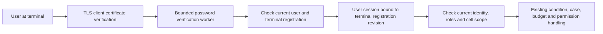

# Binding users, registered terminals and HTTPS identities

2026-09-11. A human user session is bound to a registered terminal verified on the actual TLS connection. Terminal certificates, user accounts and operating conditions are distinct checks. Authentication success alone does not create qualification, entry conditions, Arm responses or native results.

## Processing boundary

`rx-api::terminal_https::TerminalHttps` is an API ingress component. It receives the existing single Runtime writer and calls the same application commands. It does not start ROS, equipment SDKs or drivers. Connections to a product supervisor/installer that supplies the actual listener, TLS material and process lifecycle are future work. The development CLI was not converted into a LAN service.

## Identity issuance

1. The server requires a client certificate trusted by the configured CA. Connections without a certificate or with a certificate from another CA do not reach the HTTP handler.
2. The terminal is identified by the SHA-256 of the leaf DER supplied by TLS. `x-forwarded-client-cert`, `x-rx-terminal` and terminal names in the body are not accepted as evidence.
3. The existing bounded Argon2 worker verifies the password. Even with a valid Root CA, an unregistered terminal does not receive a user session.
4. The writer checks the currently active user and exactly one active Terminal corresponding to the certificate. User and terminal permitted-cell sets must overlap.
5. It stores `TerminalBinding{id, certificate_digest, revision}` in the Session. Request Identity is constructed from this result, not determined by the body.
6. The browser receives the existing 256-bit opaque token cookie. The token itself is not authority material, and only its digest is stored in server memory. HTTPS cookies specify Secure, HttpOnly, SameSite=Strict and the `/api` path.

Ordinary development login sessions have terminal=None. The core rejects even an internally assembled Identity that merely adds a terminal ID/certificate to such a session. Host/Executor/OPERATOR_API accounts cannot open user login sessions.

## Checks on every request

HTTPS middleware compares the cookie's terminal certificate with the certificate on the current TLS connection. The cookie therefore cannot be reused even at another registered terminal issued by the same CA. Normal TLS reconnection from the same terminal is allowed.

The writer rechecks Session runtime boot/expiry/active status, current user roles, stored TerminalBinding and current terminal registration revision/active status/certificate. Effective cells are the intersection of user and terminal cells. This scope also applies to overview/profile/individual queries. Current identity and authority checks occur before returning stored idempotency responses.

An actual change to terminal registration makes previous sessions unusable and revokes/latches authority in the related cell closure. Pending starts are also invalidated. A registration request with identical content returns the existing revision under exact CAS, so simple reapplication does not disconnect sessions. Registration changes and required invalidation share the same writer transaction.

Logout ends the corresponding user session. It is not the same as cancelling an already accepted operating intent or commanding a physical stop. Network disconnection/lost HTTP responses also do not roll back existing commands. Rules for retrieving the original key/body and checking current P state remain.

Even with a cookie that has expired or disappeared through server restart, login itself can be retried with a new password submission and the current TLS terminal. Non-login paths cannot continue using an old cookie.

## Behavior verified for start requests

Actual HTTPS tests verified that Alice + registered panel/a can submit StartRun through ARMING in a simulated cell with synthetic qualification/Host preparation. No Host Arm response was produced, so EXECUTING or native success is not claimed.

Resending the same start key retrieves the same attempt. Disabling the terminal rejects even the current cookie with the same key, and does not restore previous pending-start authority. A cell without qualification rejects with NOT_COMMISSIONED even for a valid user and terminal. User-role revocation is also checked before cached requests.

## Separation of humans and services

Paths that add Operator/RecoveryLead roles to service accounts to submit ProcedureRecord as a human or become a case lead are blocked as well. Native/observation evidence from services is accepted through the Host evidence path, not disguised as human procedure reports. Existing stored records are not deleted.

Consequently, the earlier draft's 'executor authentication + additional human role' method is no longer used for human reports. Frozen gRPC human writes such as RecordProcedure must be activated only after connecting a separate binding that ties a verified user/terminal session to the OPERATOR_API call. Actual-user paths through current direct HTTPS and development HTTP call the application.

Authentication verifies possession of a certificate private key and account credentials. It does not establish a person's physical site location, attention or safety-function state. Physical access/isolation/recovery guards and actual work results require separate verification through their respective procedures and Host/equipment evidence.

## Server configuration and limitations

| Item | Current configuration |
|---|---|
| Module | rx-api `TerminalHttps::new` / `serve` |
| Inputs | Existing ApplicationPort, Credentials, exact HTTPS origin, server certificate/key, terminal CA |
| origin | Direct same-origin HTTPS; proxy certificate headers are not trusted |
| HTTP | HTTP/1.1, maximum message body 1 MiB, login body 4096 bytes |
| Concurrent connections/tasks | At most 64 |
| TLS/header wait | At most 5 seconds each |
| HTTP connection lifetime | At most 60 seconds; long-lived SSE/stream paths are not yet provided |
| shutdown | Stop new connections, interrupt incomplete handshakes, clean up network connections after HTTP graceful drain |
| Certificate reuse | Early data and server session storage/TLS 1.3 ticket issuance disabled |
| User sessions | Existing 1-hour duration, current P session expiry and terminal registration rechecks |
| TLS material | At most 128 KiB per input, at most 16 certificates per chain; in-image deployment/secret mount management is future work |

Client certificate distribution/rotation/revocation UI, actual browser certificate installation, S UI endpoints and product HTTPS routing, OPERATOR_API gRPC user delegation, and product daemon/two-image deployment are incomplete. Service lifecycle verification of new TLS libraries is not expanded into completion of the full equipment supervisor/site acceptance.

The API reuses existing versioned mutation handlers. The new HTTPS configuration assumes direct connections; it does not support converting forwarded headers behind a TLS-terminating reverse proxy into terminal evidence.

## Storage version and SDK synchronization

Because the Session format and identity-check semantics changed, the store uses schema5. The version barrier was raised to prevent earlier runtimes from reading new records while ignoring terminal bindings. Existing session bytes remain unchanged, and terminal proofs are not automatically populated. The existing Runtime boot rule invalidating sessions is also preserved.

During review, phase32's P store was found to have advanced to schema4 while the S SDK copy remained at schema3. This change exports shared rx-storage and migrations 0004/0005 together, aligning both sides to schema5. The SDK contains 74 payloads, or 75 files including the separate source-lock. Authority/application code is excluded from the SDK.

`python3 tools/check_host_sdk.py ../rx-solutions/sdk` checks not only the SDK's own inventory but also byte-level agreement with a fresh export from current P. A regression check verified that the SDK from the actual phase32 archive is rejected as stale even when its own hashes match. Passing tests in each repository alone does not imply copy synchronization.

## Dependencies and evidence

The existing lock's rustls 0.23.44 / tokio-rustls 0.26.5 / hyper 1.11.1 / hyper-util 0.1.20 were used. Adding the manual-root TLS feature for test reqwest 0.12.28 added lock entries such as hyper-rustls 0.27.9. The presence of optional QUIC-related lock entries is not interpreted as HTTP/3 support in the operating API. The actual API uses only HTTP/1.1, and the normal dependency tree was also retained.

The adapter passing an Axum router's Tower service to a Hyper connection was checked against the [official hyper-util API](https://docs.rs/hyper-util/0.1.20/hyper_util/service/struct.TowerToHyperService.html). Rustls verifier/PEM and Hyper timeout configuration were checked against the pinned crate sources in use and actual build/connection tests. Failed web retrieval of two versioned documentation URLs was not used as certificate-verification evidence.

## Verification scope

- Actual TLS: No certificate/other CA/unregistered terminal, forwarded-header/body impersonation, cookie replay from another registered terminal, relogin after a stale cookie, Secure logout.
- Actual writer/SQLite: User/terminal scope intersection, registration revision changes and rejection of previous sessions, rejection of incorrectly assembled Identity, user-role revocation, normal start acceptance/same-key retrieval/rejection of rerequests after terminal revocation.
- Rejection for unmet qualification, rejection of procedure reports/lead assignment with mixed human and service roles, server shutdown with an incomplete TLS connection.
- Platform tests on macOS and an isolated Linux environment, S SDK/executor tests, and existing separate Host/Executor/Evidence and browser regressions.

Physical qualification, physical stopping, actual CNC/robot communication and user-terminal deployment validation were not performed. This document records the implemented authentication boundary and verification scope.
