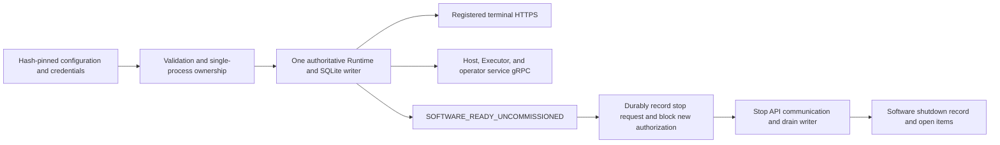

# Platform executable and first runtime image

2026-09-11. `rx-platformd` connects direct terminal HTTPS and platform gRPC to one SQLite writer. The current qualification authority is **NOT_CONNECTED**. This draft packages initial startup, diagnostics, authentication, and storage into an executable form; it is not presented as a completed product for physical operation or whole-site shutdown.

## Execution composition



- Execution does not start ROS, BT, controller_manager, or device Hosts. It does not automatically activate selected-device drivers or start existing Runs.
- Both HTTPS and gRPC addresses are acquired before opening the writer and composing services. An address conflict does not leave a partially started service set.
- One process owns the runtime directory through an OS file lock. A separate SQLite writer lock is also retained. A second process cannot overwrite the running process's status file.
- Linux execution uses `/proc/sys/kernel/random/boot_id` and CLOCK_BOOTTIME to share `linux-boottime/<kernel boot UUID>` with S. `run` is rejected on non-Linux systems. The local UI development API is separate.
- Status files are updated through temporary files, fsync, and rename, with schema/installation ownership checks. Files from other installations and symlinks are not overwritten. Status files alone do not establish process liveness.

## Configuration and initialization

Commands:

```text
rx-platformd init /absolute/path/startup.json
rx-platformd run /absolute/path/startup.json
```

The schema of `config::Config` is `rx.platform-startup.v1`.

| Input | Meaning |
|---|---|
| installation_id, release_digest | Configuration values for installation identity and service negotiation; do not replace acceptance of a signed release |
| data_directory | Installation directory created during initialization; stores `platform.db` and the installation descriptor |
| runtime_directory | Writable directory prepared in advance; stores the OS lock and current process status |
| catalog | Absolute path and SHA-256 of the initial bootstrap catalog |
| credentials | Path and SHA-256 of the existing Argon2 credential catalog |
| https | Bind address, exact HTTPS origin, pinned server certificate/key/terminal CA files |
| grpc | Bind address, server certificate/key/client CA, allowed leaf fingerprints, and service principals |

Each pinned file must be an actual regular file of at most 1 MiB with a matching hash. On Unix, keys/credentials reject group/world access. TLS materials receive preflight through the existing TLS parser; Root CA validation is not disabled. Data/runtime directories are separate.

The bootstrap catalog is `rx.platform-bootstrap-catalog.v1` and contains the bootstrap principal, additional principals, terminals, and cells. Initialization completes the DB and catalog in a temporary directory on the same filesystem, closes the writer, writes/syncs the descriptor, and renames to the final directory. Failed initialization does not publish the final data directory. `init` does not overwrite existing installations.

Restart checks installation/catalog identity but does not reapply the initial catalog to the DB. Account permissions and registration data changed during operation are not reverted to their initial values. The descriptor's qualification_mode is fixed to UNCOMMISSIONED_DRAFT, preventing the current binary from replacing verification authority with a PASS value in startup JSON.

Actual signing/verification authority for qualification and site packages remains future work. Optional host_links can configure connection/lease/dispatcher services waiting for an authenticated publisher. Physical source/driver readiness and explicit rebind remain future work. The existence of HostClient/Dispatcher libraries does not establish completed automatic configuration.

## Shutdown semantics

SIGINT/SIGTERM or API-service/writer failure calls `RequestRuntimeStop` first. This command is for the local process owner and is not exposed as a public user/device RPC.

One transaction records STOP_REQUESTED and the stop ID and invalidates all current cell closures. It revokes existing mandates/permits/pending starts and marks only operations definitively not sent as NOT_EXECUTED under existing rules. Operations that may have executed are not converted into canceled/completed outcomes.

`ready`, new Run creation, and new Cell installation/qualification proceed only while this lifecycle barrier is SERVING. Existing results, reads, intervention facts, and reconciliation can continue. Repeating the same stop request does not repeatedly increment epochs. Failure before storage rolls back; response loss after commit is observed through the original stop ID.

API listeners are then stopped/drained while preserving work already admitted to the writer. After at most 10 seconds, API drain cleans up only network tasks. It does not kill device Hosts/controllers after a timeout. Finally, STOP_COMMITTED and current open items are recorded, and shutdown waits for the writer to actually close.

StopReport attention includes retained work, unconfirmed Fences for currently registered Hosts, and open cases. At most128 items are displayed, with total count and truncated recorded separately. Native work/resources with unknown processing outcomes are preserved. `physical_shutdown_assessed` is always false.

| Process exit | Meaning |
|---|---|
| 0 | Software service/writer shutdown completed with no attention in the current report |
| 2 | Software shutdown recorded, but work/Hosts/cases still require inspection |
| 1 | Startup, service, writer, or shutdown-record failure |

No exit code proves torque release, physical support handover, laser/CNC stopping, or access authorization. This executable's shutdown is **P process shutdown**. Normal shutdown of the whole site requires additional Host/device procedures and evidence. This executable does not bring down Hosts and drivers together with itself.

A new Runtime boot starts the software lifecycle at SERVING while preserving restart invalidation and revalidation blocks for existing cells. It does not revive earlier execution authority. Shutdown/startup lifecycle remains in history. The storage schema6 barrier and current SDK source synchronization checks were applied.

## Container

Build:

```text
docker build -f docker/Platform.Dockerfile --target runtime -t rx-platform:runtime-draft .
```

The builder uses digest-pinned Rust 1.98.1 Bookworm; runtime uses digest-pinned Ubuntu 24.04. Only API executables, the offline package storage tool, and runtime userland are copied into the final image; ROS, compilers, and source mounts are unnecessary. Default USER is 10001:10001, ENTRYPOINT is rx-platformd, default configuration is `/etc/rx/platform/startup.json`, and SIGTERM is used.

Operational deployment uses a read-only root filesystem, cap-drop ALL, no-new-privileges, read-only configuration/secrets, and separate writable data/runtime areas. The actual image's init → HTTPS startup → SIGTERM → STOP_COMMITTED path was tested under these permissions. Disposable-volume ownership was set only during fixture preparation; the running container is non-root.

`tools/test_platform_image.py` creates disposable CA/certificates/catalog and two isolated volumes, then removes them after use. It cleans up only containers/volumes it created. Test certificate chains explicitly include CA/leaf DNs and AKI to pass Python/OpenSSL verification without disabling verification.

The current validation covers one linux/arm64 **platform runtime draft** image. amd64 execution, GPU variants, complete product configuration/installation tooling, and a solutions product image containing the required first-party stack remain future work. Existing solutions validation images are not counted as product images. Container Running/health is not physical operating readiness.

## Validation

- application: stop-barrier rollback/response loss/duplication, rejection of new authority, preservation of UNKNOWN and open-item lists.
- composition: actual HTTPS login/reads and gRPC negotiation/reads, two startup/shutdown cycles, no bootstrap permission reapplication, rejection of duplicate processes and incorrect pins.
- Linux: actual executable init/run, shared clock, SIGTERM handling, and confirmed process exit.
- Actual image: USER 10001, read-only root, cap-drop, HTTPS health, and normal software shutdown.
- Existing P/S, Host/Executor/Evidence, and browser regressions. Physical devices, whole-site shutdown, and update/restore acceptance are separate.

Host connection configuration and current limitations follow [Host bootstrap](../rx-host-client/HOST_CONNECTION.md). Connection registration is not used as operating-condition PASS or driver startup.

The Host connection service performs atomic source collection. Independent maintained-condition monitoring checks observation expiry separately from the network. Follow the decision, shutdown, and performance scope in [observation ingestion and expiry monitoring](../rx-application/OBSERVATION_INGESTION.md).

## Offline package storage tool

The same P image includes `rx-package-store`. It verifies/stores signed packages from pinned local policy and an import root, and revalidates them under current policy. This explicit administration tool is separate from default daemon startup and does not modify cell ledgers, approvals, or activation. Configuration, volumes, and failure/rerun semantics are in the [package storage specification](../rx-package/STORE.md).

Optional startup configuration `package_intake` can configure an online intake worker per user/cell. Configuration, currentness, and failure boundaries are in [intake acceptance](../rx-application/PACKAGE_INTAKE.md). The Store exclusively owns `packages` under the data directory and rechecks the policy file pin on each new acquisition.

Supplying pinned verifier public keys/allowed validator materials in `package_intake.review_authority` activates the process review worker. It does not read private keys. Follow the [approval scope and startup configuration](../rx-application/PROCESS_REVIEW.md).

Optional `package_intake.qualification_policy` is the pinned policy for revalidation materials. It configures [evidence and independent review](../rx-application/REQUALIFICATION_REVIEW.md) without connecting activation qualification authority or permitting operation through startup.
