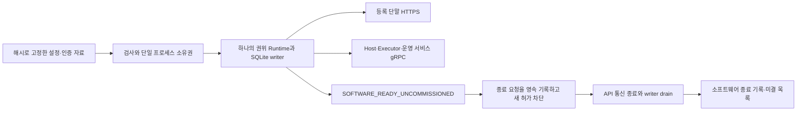

# 플랫폼 실행 파일과 첫 런타임 이미지

2026-09-11. `rx-platformd`는 하나의 SQLite writer에 직접 terminal HTTPS와 platform gRPC를 연결하는 실행 파일이다. 현재 qualification authority는 **NOT_CONNECTED**다. 이는 초기 기동·진단·인증·저장 경로를 실행 가능한 형태로 묶은 초안이며, 실물 운전과 전체 현장 종료를 완료한 제품으로 표시하지 않는다.

## 실행 구성



- 실행 시 ROS·BT·controller_manager·장비 Host를 기동하지 않는다. 선택 장비의 driver를 자동 활성화하거나 기존 Run을 시작하지 않는다.
- HTTPS와 gRPC의 주소를 모두 확보한 후 writer를 열고 서비스를 구성한다. 한 주소가 충돌하면 절반만 시작한 서비스 세트를 만들지 않는다.
- runtime directory는 OS 파일 잠금으로 하나의 프로세스만 소유한다. 별도 SQLite writer 잠금도 유지한다. 두 번째 프로세스가 실행 중인 상태 파일을 덮어쓰지 못한다.
- Linux 실행은 `/proc/sys/kernel/random/boot_id`와 CLOCK_BOOTTIME을 사용해 S와 `linux-boottime/<kernel boot UUID>`를 공유한다. 비-Linux에서는 `run`을 거부한다. 로컬 UI 개발 API는 별도다.
- 상태 파일은 임시 파일·fsync·rename으로 갱신하고 schema/installation 소유권을 확인한다. 다른 설치의 파일이나 symlink를 덮어쓰지 않는다. 상태 파일만으로 프로세스 생존을 단정하지 않는다.

## 설정과 초기화

명령:

```text
rx-platformd init /absolute/path/startup.json
rx-platformd run /absolute/path/startup.json
```

`config::Config`의 schema는 `rx.platform-startup.v1`이다.

| 입력 | 의미 |
|---|---|
| installation_id, release_digest | 설치 식별과 서비스 협상에 사용할 설정값. 서명된 release 인수 완료를 대신하지 않음 |
| data_directory | 초기화 시 새로 만들 설치 디렉터리. `platform.db`, installation descriptor 저장 |
| runtime_directory | 사전에 준비한 writable 디렉터리. OS lock·현재 process status 저장 |
| catalog | 최초 bootstrap catalog의 absolute path와 SHA-256 |
| credentials | 기존 Argon2 credential catalog의 path와 SHA-256 |
| https | bind address·정확한 HTTPS origin·server certificate/key/terminal CA의 pinned file |
| grpc | bind address·server certificate/key/client CA·허용 leaf fingerprint와 service principal |

각 pinned file은 최대 1 MiB의 실제 regular file이어야 하며 hash가 일치해야 한다. key/credentials는 Unix에서 group/world 접근을 거부한다. TLS 자료는 기존 TLS parser로 preflight하고 Root CA 검증을 끄지 않는다. data/runtime 디렉터리는 분리한다.

Bootstrap catalog는 `rx.platform-bootstrap-catalog.v1`이며 bootstrap principal, 추가 principals, terminals, cells를 가진다. 초기화는 같은 filesystem의 임시 디렉터리에 DB와 catalog를 완성하고 writer를 닫은 뒤 descriptor를 기록·동기화하고 최종 디렉터리로 rename한다. 실패한 초기화는 최종 data directory를 공개하지 않는다. 기존 설치를 `init`으로 덮어쓰지 않는다.

재시작은 installation/catalog 식별을 확인하지만 초기 catalog를 DB에 다시 적용하지 않는다. 운영 중 바꾼 계정 권한이나 등록 데이터를 초기값으로 되돌리지 않는다. descriptor의 qualification_mode는 UNCOMMISSIONED_DRAFT로 고정되어 있다. 현재 binary가 검증 authority를 startup JSON의 PASS 값으로 대신하지 않게 한다.

자격·현장 패키지의 실제 서명/검증 authority는 후속이다. optional host_links 설정으로 인증된 publisher를 기다리는 연결·lease/dispatcher 서비스를 구성할 수 있다. 실물 source/driver 준비와 명시적 rebind는 후속이다. 기존 HostClient/Dispatcher 라이브러리가 있다는 사실을 자동 구성 완료로 표시하지 않는다.

## 종료 의미

SIGINT/SIGTERM 또는 API service/writer 실패는 `RequestRuntimeStop`을 먼저 호출한다. 이것은 로컬 process owner용 명령이며 public 사용자/장비 RPC로 노출하지 않는다.

하나의 transaction에서 STOP_REQUESTED와 stop ID를 기록하고 모든 현재 cell closure를 invalidation한다. 기존 mandate/permit·pending start를 철회하고, 확실히 미전송인 작업만 기존 규칙으로 NOT_EXECUTED 처리한다. 이미 실행되었을 가능성이 있는 작업을 취소·완료로 만들지 않는다.

`ready`, 신규 Run 생성, 신규 Cell 설치/qualification은 이 lifecycle barrier가 SERVING일 때만 진행한다. 기존 결과·조회·개입 사실·reconciliation은 계속 처리할 수 있다. 같은 stop 요청을 재호출해도 epoch를 반복해서 올리지 않는다. 저장 전 실패는 rollback이고 commit 후 응답 유실은 원래 stop ID로 관측된다.

그 다음 API listener를 종료·drain하고 writer에 이미 접수된 작업을 유지한다. API drain은 최대 10초 후 네트워크 task만 정리한다. 장비 Host/controller를 timeout으로 kill하는 동작이 아니다. 마지막으로 STOP_COMMITTED와 현재 미결 상태를 기록하고 writer가 실제 닫힐 때까지 기다린다.

StopReport의 attention에는 retained work, 현재 등록 Host의 미확인 Fence, 열린 case가 들어간다. 최대 128개를 보여주며 전체 개수와 truncated를 따로 기록한다. 아직 처리 결과를 모르는 native 작업·자원은 보존한다. `physical_shutdown_assessed`는 항상 false다.

| 프로세스 exit | 뜻 |
|---|---|
| 0 | 소프트웨어 서비스/writer 종료가 완료되고 현재 report의 attention이 없음 |
| 2 | 소프트웨어 종료는 기록됐지만 확인할 작업/Host/case가 남음 |
| 1 | 기동·서비스·writer/종료 기록 실패 |

어떤 exit code도 토크 해제·물리 지지 인계·레이저/CNC 정지·접근 허가를 입증하지 않는다. 현재 실행 파일의 종료는 **P 프로세스 종료**다. 전체 현장의 정상 종료는 필요한 Host/장비 절차와 근거를 추가로 연결해야 한다. Host와 driver를 이 실행 파일이 함께 내리지 않는다.

새 Runtime boot는 software lifecycle을 SERVING으로 시작하되 기존 cell의 restart invalidation과 재검증 차단을 유지한다. 기존 실행 권한을 부활시키지 않는다. 종료/기동 lifecycle은 history로 남는다. 저장소 schema6 barrier와 현재 SDK source 동기화 검사를 적용했다.

## 컨테이너

빌드:

```text
docker build -f docker/Platform.Dockerfile --target runtime -t rx-platform:runtime-draft .
```

builder는 digest로 고정한 Rust 1.98.1 Bookworm, runtime은 digest로 고정한 Ubuntu 24.04다. 최종 이미지에는 API 실행 파일·오프라인 패키지 보관 도구와 runtime userland만 복사하며 ROS·컴파일러·소스 mount가 필요하지 않다. 기본 USER는 10001:10001, ENTRYPOINT는 rx-platformd, 기본 config 위치는 `/etc/rx/platform/startup.json`, SIGTERM을 사용한다.

운영 형태에는 읽기 전용 root filesystem, cap-drop ALL, no-new-privileges, read-only config/secrets와 별도의 writable data/runtime 영역을 사용한다. 이 권한으로 실제 이미지의 init→HTTPS 기동→SIGTERM→STOP_COMMITTED를 시험했다. fixture 준비 때만 disposable volume의 ownership을 설정했으며 실행 컨테이너는 비루트다.

`tools/test_platform_image.py`는 일회성 CA/인증서·catalog와 두 개의 격리 volume을 만들고 사용 후 지운다. 자기 자신이 만든 container/volume만 정리한다. 테스트 인증서 체인의 CA/leaf DN과 AKI를 명시해 Python/OpenSSL 검증을 통과시키며, 검증을 비활성화하지 않는다.

현재 검증한 것은 linux/arm64의 **platform runtime draft** 한 이미지다. amd64 실행, GPU variant, 전체 제품 설정/installation tooling, 자사 필수 스택을 포함한 solutions 제품 이미지는 후속이다. 기존 solutions validation 이미지를 제품 이미지로 세지 않는다. 컨테이너 Running/health와 실물 운전 준비를 같게 보지 않는다.

## 검증

- application: stop barrier의 rollback/응답 유실/중복, 새 authority 거부, UNKNOWN·미결 목록 보존.
- composition: 실제 HTTPS 로그인/조회와 gRPC 협상/조회, 두 차례 기동/종료, bootstrap 권한 재적용 금지, 중복 프로세스·잘못된 pin 거부.
- Linux: 실제 executable init/run, shared clock, SIGTERM 처리와 process 종료 확인.
- 실제 이미지: USER10001, read-only root, cap-drop, HTTPS health와 정상 소프트웨어 종료.
- 기존 P/S·Host/Executor/Evidence·browser 회귀. 물리 장비/전체 현장 종료/업데이트·복원 인수는 별도다.

Host 연결 설정과 현재 제한은 [Host bootstrap](../rx-host-client/HOST_CONNECTION.md)를 따른다. 연결 등록을 운전 조건 PASS나 driver 기동으로 사용하지 않는다.

Host 연결 서비스는 원자적 source 수집을 수행한다. 독립 유지 조건 감시는 네트워크와 별도로 관측 만료를 확인한다. [관측 수집과 만료 감시](../rx-application/OBSERVATION_INGESTION.md)의 판정·종료·성능 범위를 따른다.

## 오프라인 패키지 보관 도구

같은 P 이미지에 `rx-package-store`를 포함한다. 고정된 로컬 정책·반입 root에서 서명 패키지를 검증·보관하고 현재 정책으로 재검증한다. 기본 daemon 기동과 분리된 명시적 관리 도구이며 셀 원장·승인·활성화를 바꾸지 않는다. 설정·volume·실패/재실행 의미는 [패키지 저장 명세](../rx-package/STORE.md)에 둔다.

선택 기동 설정 `package_intake`로 사용자/셀별 온라인 반입 worker를 구성할 수 있다. 설정·현재성·실패 경계는 [반입 접수](../rx-application/PACKAGE_INTAKE.md)에 둔다. Store는 data directory의 `packages`를 독점 소유하고, 매 신규 취득에서 policy 파일 pin을 다시 검사한다.

`package_intake.review_authority`에 고정된 검증자 공개키/허용 validator 자료를 주면 공정 검토 worker를 활성화한다. 개인키는 읽지 않는다. [승인 범위와 기동 설정](../rx-application/PROCESS_REVIEW.md)을 따른다.

선택 `package_intake.qualification_policy`는 재검증 자료의 pinned 정책이다. [근거·독립 검토](../rx-application/REQUALIFICATION_REVIEW.md)를 구성하며 activation qualification authority를 연결하거나 startup으로 운전을 허용하지 않는다.
